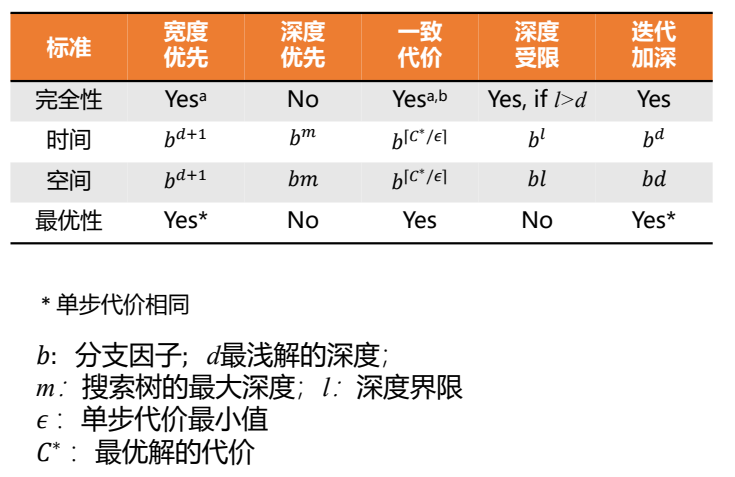

# 高级人工智能 - 课程笔记

## 搜索

五要素：初始状态，动作，转换模型，目标测试，和路径代价

- 完备性：是否能够找到存在的结果
- 时间复杂度
- 空间复杂度
- 最优性：发现的结果是否是代价最小的

复杂度由三个量表达：

- 分子因子`b`：搜索树中结点的最大分支数
- 深度`d`：目标节点所在的最浅深度
- `m`：任何路径的最大长度

- 盲目搜索：$f(x) = g(x)$
- 启发式搜索：知道非目标状态是否比其他状态更有希望接近目标
    - 贪婪式搜索：$f(x) = h(x)$
    - A*搜索：$f(x) = g(x) + h(x)$

### 启发式

#### A\*搜索

评估函数：

$$f(n)=g(n)+h(n)$$

- $g(n)$ 从开始节点到n的代价
- $h(n)$从节点n到目标结点的最小代价路径的估计值

可采纳启发式(Admissible Heuristic)：$h(n)\leq h^{*}(n)$，$h^{*}(n)$为$n$到目标结点的真正代价，即永远不会高估真实的代价

一致的启发式(Consistent Heuristic)：$h(n)\leq c(n, a, n’) + h(n’)$，到当前节点到目标的代价不大于后继节点的单步代价与后继节点到目标的估计代价之和，即$f(n)$非递减

可采纳的树搜索最优，一致的树/图搜索$\rightarrow$最优的

证明：

可采纳的树搜索最优：反证法，假设A\*算法的解不是最优的，则最优解的任意祖先f都更小，必然先被扩展，最优解将比A\*算法的解先被扩展，因此必然能找到最优解

一致的图搜索最优：归纳

### 局部搜索

爬山法、局部束搜索

### 元启发

通用的启发式策略，不借助问题的特有条件

禁忌搜索，模拟退火，遗传算法

#### 遗传算法

- 适应度(Fitness)函数: 个体的适应度值越大，它被遗传到下一代种群中的概率越大
- 遗传操作(Genetic Operator)
    - 选择
    - 交叉
    - 变异
- 遗传编码：二进制编码是将原问题的结构变换为染色体的位串结构

算法基本步骤:

1. 选择编码策略，将问题搜索空间中每个可能的点用相应的编码策略表示出来，即形成染色体;
2. 定义遗传策略，包括种群规模$N$，交叉、变异方法，以及选择概率$P_r$、交叉概率$P_c$、变异概率$P_m$等遗传参数;
3. 令$t=0$，随机选择$N$个染色体初始化种群$P(0)$;
4. 定义适应度函数$f$;
5. 计算$P(t)$中每个染色体的适应值;
6. $t=t+1$;
7. 运用选择算子，从$P(t-1)$中得到$P(t)$;
8. 对$P(t)$中的每个染色体，按概率$P_c$参与交叉;
9. 对染色体中的基因，以概率$P_m$参与变异运算;
10. 判断群体性能是否满足预先设定的终止标准，若不满足返回(5)。

### 对抗/博弈搜索

MiniMax，对方选Min，我放选Max

alpha-beta剪枝：$\alpha \geq \beta$时

- alpha: 最大下界，max层更新
- beta: 最小上界，min层更新

DFS时候会由子节点先更新父节点将结果传递到其他子节点（向上传递交替alpha beta，向下不变alpha beta）

蒙特卡洛树搜索：UCB算法，潜力$UCB1=\overline{X_j}+\sqrt{\frac{2\ln{n}}{n_j}}$

- 选择
- 扩展
- 模拟
- 回溯

1. 由当前局面建立根节点，生成根节点的全部子节点;
2. 从根节点开始，进行最佳优先搜索;
3. 利用UCB公式计算每个子节点的UCB值，选择最大值的子节点;
4. 若此节点不是叶节点，则以此节点作为根节点，重复2;
5. 直到遇到叶节点，如果叶节点未曾经被模拟对局过，对这个叶节点模 拟对局;否则为这个叶节点随机生成子节点，并进行模拟对局;
6. 将模拟对局的收益(一般胜为1负为0)按对应颜色更新该节点及 各级祖先节点，同时增加该节点以上所有节点的访问次数;
7. 回到2，除非此轮搜索时间结束或者达到预设循环次数;
8. 从当前局面的子节点中挑选平均收益最高的给出最佳着法

## 逻辑

$\alpha\equiv\beta$当且仅当$\alpha\Leftrightarrow\beta$

$\alpha\Rightarrow\beta \equiv \neg\alpha \lor \beta$

逻辑蕴含，$\alpha \models \beta$，当且仅当在使$\alpha$为真的模型中，$\beta$为真

- 可靠性：只能生成被蕴含的语句
- 完备性：生成所有被蕴含的语句

BNF范式，否定$\neg$，合取、析取、蕴含、等价

- 有效性：在所有模型中为真
- 可满足性：某些模型中为真

归结定理可靠+完备：证明$KB\vdash \alpha$，需证明$KB\land \neg \alpha$不可满足，$S=\{KB,\neg\alpha\}$，RC(S)为归结闭包，则证明S不可满足$\Rightarrow$RC(S)包含空子句，即证逆否命题：RC(S)不包含空子句，则S可满足

构造model，S的原子命题$R_{1},\cdots, R_{l}$，RC(S)子句中包含$\neg R_{i}$，其他文字被指派为False，则$R_{i}$被指派为True，否则指派为False。只需证明该真值指派使RC(S)所有子句为真即S是可满足的。假设第一个False子句，可能是False$\lor$False$\cdots R_{i}$和False$\lor$False$\cdots \neg R_{i}$，满足归结，且归结后为False

$KB\vdash \alpha$当且仅当$\{KB, \neg \alpha \} \vdash \phi$，$\vdash$近使用归结法获得新子句

CNF范式，文字析取式的合取式

CNF转换：

1. 消去等价，转为双蕴含
2. 消去蕴含
3. 使用德摩根率与双重否定
4. 分配律

子句集S的归结闭包RC(S)：对S中子句或派生子句反复使用归结规则生成的所有子句的集合

基本归结定理：如果子句集S是不可满足的，那么RC(S)包含空子句

Horn子句：只包含一个正文字的析取式；对归结封闭

推理过程：前向/后向链接，前向连接：蕴含式前提已知则将结论添加，后向：从结论出发，查看前提是否都为真

## 概率论

$P(x|y)=\frac{P(x,y)}{P(y)}$

乘法规则：$P(a|b)P(b) = P(b|a)P(a)$

贝叶斯规则：$P(a|b) = \frac{P(b|a)P(a)}{P{b}}$

贝叶斯网，箭头表示条件概率（联合概率需要条件概率成箭头原点概率，多级箭头只需要乘最开始那个原点），单点表示概率，相乘即可

给定一个节点的父节点，该节点与祖先节点条件独立

马尔可夫毯：在随机变量全集$U$中，对给定变量$X\in U$和变量集$MB\subset U(X\notin MB)$，若有$X\perp \{U-MB-{X}\}|MB$，则$MB$为$X$的马尔可夫毯

贝叶斯网络中节点的马尔可夫毯为父节点、子节点以及子节点的其他父节点

- 通过：马尔可夫链，基于中间节点条件独立
- 反弹：独立
- 截止：条件独立

球不能到达则两节点关于中间节点集独立

- 未知节点：总能使球通过，反弹从子节点方向来的球
- 已知节点：反弹从父节点方向过来的球，截止从子节点方向来的球

精确推理：基本任务

- 证据变量$E_1, \cdots, E_k$
- 询问变量$Q$
- 隐藏变量$H_{1}, \cdots, H_{r}$
- 计算条件概率$P(Q|e_1, \cdots, e_k)$

1. 选择与证据变量一致的部分
2. 对未观测变量求和消元：按照从右到左的顺序计算，保存中间结果避免重复计算
3. 归一化

近似推理：

- 先验采样：由$P(X_i | parents(X_i))$
- 拒绝采样：计算$P(C|r, w)$，拒绝$\neg r, \neg w$，会拒绝过多的样本
- 似然加权：只生成与证据一致的事件
- 吉布斯采样：基于其他所有变量（马尔可夫毯）概率重采样

## 机器学习

损失函数：

- 经验风险：模型在训练集的平均损失
- 期望风险：模型在全部数据集上平均损失
- 结构风险：经验方向+正则化项，防止过拟合

使用L2范数直接拉向原点
使用L1范数会拉向坐标轴，即尝试将某些坐标设置为0.

### 有监督学习

有标记的训练数据

- 产生式模型：对联合分布进行推断，使用贝叶斯定理计算条件分布
- 判别式模型：直接估计

产生式直接划线，判别式先学习出来Model区域

#### 线性回归

$F = \{f_w : w\in R^{2}\}$

$Loss(x, y, w) = f_w(x) - y)^{2}$

$TrainLoss(w) = \frac{1}{|D_{train}|}\sum_{(x, y)\in D_{train}}Loss(x, y, w)$

最大似然估计：最大化似然等驾驭最小化平方误差和

- 训练误差
- 泛化误差：从原始样本分布中抽取无限多数据样本时误差的期望

#### 过拟合与正则化

正则项：经验损失函数中添加一个惩罚项，不鼓励复杂的模型

### 无监督学习

#### 聚类

闵式距离：$dist(x_i,x_j) = (\sum_{d=1}^{D}|x_{id} - x_{jd}|^{p})^{1/p}$，$p=1$曼哈顿距离，$p=2$欧氏距离

K-Means

- 损失函数：$Loss_{kmeans}(z, \mu) = \sum\limits_{i=1}^{n}||\phi(x_i)-\mu_{z_i}||^{2}$
- 优化目标：$\min\limits_{z}\max\limits_{\mu}Loss_{kmeans}(z,\mu)$

初始化：随机确定第一个类的中心，其他类中心尽量远离

1. 初始化选择K个点作为k个簇的中心
2. 计算数据点到中心的距离，以最短的来划分簇
3. 利用簇内点重新计算簇中心位置，重复2，直到簇中心不更新

局限性：不同尺寸、不同密度、非凸形状
克服：使用更大的簇、用小簇表示真是簇、基于密度，预处理、后处理

能处理大规模数据，可扩展型好；当簇接近高斯分布时，效果较好
默认假定簇为球形且每个簇的概率相等

### 半监督学习

- 归纳学习
    - 学习函数$f$用于预测测试数据$x_{test}$的标签
- 直推学习
    - 没有显式的学习函数

- 平滑假设：高密度空间两个点$x_1, x_2$距离较近，对应的输出也接近
- 聚类假设：如果两个点在同一个簇，则很有可能属于同一个类
- 流形假设：
    - 高维数据大致会分布在低维得流形上
    - 临近样本拥有相似的输出
    - 临近程度常用相似程度刻画

#### Wrapper方式

- 两个模块迭代
    - 训练：使用标注数据训练一个或多个监督学习器
    - 伪标注：使用学习器给无标注数据打标签

自训练：假设输出的高度置信预测是正确的；自己训练结果当作自己的标注

协同训练：学习两种特征，训练两个分类器互相预测和标注
假设：特征可分裂，能够单独训练处好的分类器，在给定类别后条件独立

多视角学习：再多一点

#### 监督扩展

生成模型同时利用伪标注数据优化决策边界

### 集成学习

每个学习器达到上限，训练多个学习器能够互补

- Bagging：降低模型的方差
    - 每次进行Bootstrap采样，得到M个模型，进行平均投票
    - 适合对偏差低、方差高的模型进行融合
    - 随机森林：多棵决策树，特征和样本随机抽取
- Boosting：降低模型的偏差
    - 在不同训练集上训练互补的弱学习器，弱学习器组合成强学习器
    - AdaBoost基本思想：重点关注前一次迭代中弱学习器失败的样本，重新加权

### 群体智能

蚁群算法：

蚂蚁留下信息素，随时间挥发，浓度大的路径在后续选择中更高概率选取

粒子群算法： 

记录过往最高点与全局历史最好位置，向全局最好转向

更新公式：

$$v_{n+1}^{(i)}=v_{n}^{(i)}+c_{1}\times r_{1}\times (p_{best}^{(i)}-x_{n}^{(i)})+c_{2}\times r_{2}\times(g_{best}-x_{n})$$

- 惯性项：$v_{n}^{(i)}$
- 记忆项：$p_{best}^{(i)}-x_{n}^{(i)}$
    - 回到历史最好位置的倾向
- 社会项：$g_{best}-x_{n}$
    - 走向全局最好位置的倾向
- $c_{i}$：权重参数
- $r_{i}$：随机参数

不保证收敛到全局最优解

#### 强化学习

从环境状态到行为的映射，选择能获得环境最大奖赏的行为

- 评价性反馈：强化学习
- 指导性反馈：直接给最好行为，监督学习

试错搜索
延迟奖励

马尔可夫决策过程：建模序列化决策过程；行为获得即时奖励、改变状态，影响长期奖励

策略：状态到行为的映射

状态转移概率：对奖励求和

$$P(s’|s,a) = \sum\limits_{r\in R} p(s’,r|s,a)$$

状态行为对的期望奖励

$$r(s,a) = \sum\limits_{r\in R}r\sum\limits_{s’\in S} p(s’, r|s,a)$$

状态-行为-下一状态的奖励

$$r(s,a,s’) = \sum\limits_{r\in R} r\frac{p(s’, r| s, a)}{p(s’|s,a)}$$

累计奖励，回报：

$$G_t = \sum\limits_{i = 1}^{T-t}R_{t+i}$$

T为最后一步，即终止态

策略$\pi$为状态到行为的映射，状态估值函数定义为：

$$v_{\pi}(s)=E_{\pi}[\sum\limits_{k=0}^{\infty}\gamma^{k}R_{t+k+1}|S_{t}=s], for\ all\ s\in S$$

行为估值函数：

$$q_{\pi}(s,a)=E_{\pi}[\sum\limits_{k=0}^{\infty}\gamma^{k}R_{t+k+1}|S_{t}=s, A_{t}=a]$$

贝尔曼方程描述当前状态与后续状态之间的关系

- 给定策略下，每个状态估值视为一个变量
- 所有状态估值形成n方程与n变量的线性方程组
- 求解即可得到估值

#### 博弈

局中人：有权决定自己行动方案的博弈参与者

假设：自私&理性

策略集合

策略：可供局内人选择的行动方案
局势：所有局中人策略形成的策略组

效用函数：局势/时间的函数，局中人最大化效用函数

##### 纳什均衡

最佳应对：局中人1针对局中人2策略t的策略s优于其他策略，则为最佳应对
占有策略：某个策略对其他局中人任何策略都是最佳应对

僵局：每个局中人策略都是最佳应对

混合策略：基于概率选择策略

- 任何有限博弈至少存在一个纳什均衡
- 寻找是困难的

社会最优

- 使参与者回报之和最大的策略选择
