# 机器学习


## 模型评估与选择

### 经验误差与过拟合

#### 名词

错误率，精度`=1-错误率`；
误差：学习期预测和样本真实情况差异
训练误差/经验误差：在训练集上
泛化误差：在新样本上

过拟合：将训练样本特殊的一些特点当作一般特点
欠拟合：并未训练好

### 评估方法

测试集：测试判别能力
测试误差：在测试集上，作为泛化误差的近似

若只有一个包含$m$个样例的数据集$D=\{(x_{1},y_{1}),(x_{2},y_{2}),\cdots,(x_{m},y_{m})\}$，问如何划分得到训练集和测试集？

#### 留出法

直接将数据集$D$划分为两个互斥的集合为训练集$S$，测试集$T$，$D=S\bigcup T, S\bigcap T=\varnothing$。

局限性：训练集和测试集的大小不易平衡，可能训练模型完善但评估不准确，可能评估完善但模型训练不准确。

#### 交叉验证法

先将数据集$D$划分为$k$个大小相似的互斥子集$D_{1}\bigcup D_{2}\bigcup \cdots \bigcup D_{k},D_{i}\bigcap D_{j}=\varnothing,(i\neq j)$。每个子集$D_{i}$都尽可能保持数据分布的一致性，即从$D$中分层采样得。

每次都用$k-1$个子集的并集作为训练集，余下的为测试集。于是有$k$组训练/测试集，进行$k$次测试，返回$k$个结果的均值。

评估结果的稳定性和保真性很大程度上依赖$k$的选取，因此也称此方法为`$k$折交叉验证`，$k$最常用取值为10，其余常用的还有5, 20。

在$D$上划分$k$个子集存在多种划分方式，因此随机使用不同的划分方式重复$p$次，评估结果为$p$次$k$折交叉验证的均值。$p$最常见为10。

特殊情况：留一法
$m$个样本只有唯一的方式划分为$m$个子集——每个子集包含一个样本；
因此只缺少一个样本，评估结果准确。
缺陷：在数据集较大时，训练模型的计算开销太大，不便调参。

#### 自助法(Bootstrap)

以自助采样为基础，给定包含$m$个样本的数据集$D$，采样产生数据集$D'$：每次随即从$D$中挑选一个样本，拷贝至$D'$，然后重回初始数据集$D$，下次采样依然能采到。过程重复执行$m$次后得到包含$m$个样本的数据集$D'$。

初始数据集$D$中约有36.8%的样本未出现在采样数据集$D'$中，于是利用$D'$为训练集，$D\\D'$为测试集。
测试结果称为`out-of-bag estimate`。

适用：数据集较小、难以有效划分训练/测试集时

缺点：改变了初始数据集的分布，会引入估计偏差，在数据量足够时，前两种方法更常用。

### 调参与最终模型

对每个参数选定变化范围和步长，从候选参数值中选出最佳

模型评估与选择中用于评估测试的数据集为`验证集`。基于在验证集上的性能进行模型选择和调参。

### 性能度量

在预测任务中，给定样例集$D=\{(x_{1},y_{1}),\cdots,(x_{m},y_{m}\}$，其中$y_{i}$为$x_{i}$的真实标记。

学习器$f$，预测结果$f(x)$，将其与真实标记$y$比较。

回归任务最常用`均方误差`：
$$
E(f;D)=\frac{1}{m}\sum\limits_{i=1}^{m}(f(x_{i}-y_{i}))^{2}
$$

一般的，对数据分布$D$和概率密度函数$p(\cdot)$，均方误差为：
$$
E(f;D)=\int(f(x_{i}-y_{i}))^{2}p(x)dx
$$

准确定义错误率/精度/查准率/查全率

分类结果混淆矩阵：

真实情况|预测结果|预测结果
:-:|:-:|:-:
真实情况|正例|反例
正例|TP（真正例）|FN（假反例）
反例|FP（假正例）|TN（真反例）

查准率$P$与查全率$R$定义为：
$$
P=\frac{TP}{TP+FP}
$$
$$
R=\frac{TP}{TP+FN}
$$

$P$与$R$是一对矛盾的度量。可做$P-R$曲线，如果一个学习器的$P-R$曲线完全包住另一个，则可断言前者性能优于前者。

`平衡点(Break-Event Point，简称BEP)`，为$P=R$时的取值。

F1度量：
$$
F1=\frac{2\times P\times R}{P+R}=\frac{2\times TP}{totalsample+TP-TN}
$$

基于$p,R$的调和平均定义的：
$$
\frac{1}{F1}=\frac{1}{2}\cdot (\frac{1}{P}+\frac{1}{R})
$$

一般的，也可以采用加权调和平均：
$$
\frac{1}{F_{\beta}}=\frac{1}{1+\beta^{2}}\cdot (\frac{1}{P}+\frac{\beta^{2}}{R})
$$

二分类混淆矩阵

#### ROC与AUC

学习器为测试样本产生一个实值或概率预测，将预测值与分类阈值相比较，大于者分为正类，否则为反类。

`ROC：受试者工作特征`

纵轴：真正例率，TPR，true positive rate
横轴：假正例率，FPR，false positive rate
$$
TPR=\frac{TP}{TP+FN}
$$
$$
FPR=\frac{FP}{TN+FP}
$$

有限测试样例下无法产生光滑的ROC曲线
若一个学习期的ROC曲线被另一个学习器的曲线被另一个学习器的曲线完全包住，后者优于前者
若交叉则无法判断，解决方法：
`AUC，area under ROC curve`：ROC曲线下的面积
$$
AUC=\frac{1}{2}\sum\limits_{i=1}^{m-1}(x_{i+1}-x_{i})\cdot (y_{i}+y_{i+1})
$$
形式化看，AUC考虑样本预测的排序质量，它与排序误差优紧密联系。
给定$m^{+}$个正例，$m^{-}$个反例，令$D^{+}$和$D^{-}$分别表示正、反例集合，则排序损失定义为：
$$
l_{rank}=\frac{1}{m^{+}m^{-}}\sum\limits_{x^{+}\in D^{+}}\sum\limits_{x^{-}\in D^{-}}(\|(f(x^{+}<f(x^{-})))+\frac{1}{2}\|(f(x^{+})=f(x^{-})))
$$

正例预测值小于反例，记一个罚分，若相等，记0.5个罚分。
于是有：
$$
AUC=1-l_{rank}
$$

#### 代价敏感错误率与代价曲线

可根据分类任务结果写出分类代价矩阵：

二分类：
真实类别|预测类别|预测类别
:-:|:-:|:-:
真实类别|第0类|第1类
第0类|0|$cost_{01}$
第1类|$cost_{10}$|0

对于二分类可定义正例，反例
此处为弥补ROC无法反映出非均等代价学习器的期望总体代价，引入代价曲线：
横轴：取值[0,1]的正例概率代价：
$$
P(+)cost=\frac{p\times cost_{01}}{p\times cost_{01}+(1-p)\times cost_{10}}
$$
其中p为样例为正例的概率；
纵轴：取值为[0,1]的归一化代价：
$$
cost_{norm}=\frac{FNR\times p\times cost_{01}+FPR\times (1-p) \times cost_{10}}{p\times cost_{01}+(1-p)\times cost_{10}}
$$
FPR，假正例率，FNR=1-TPR，假反例率

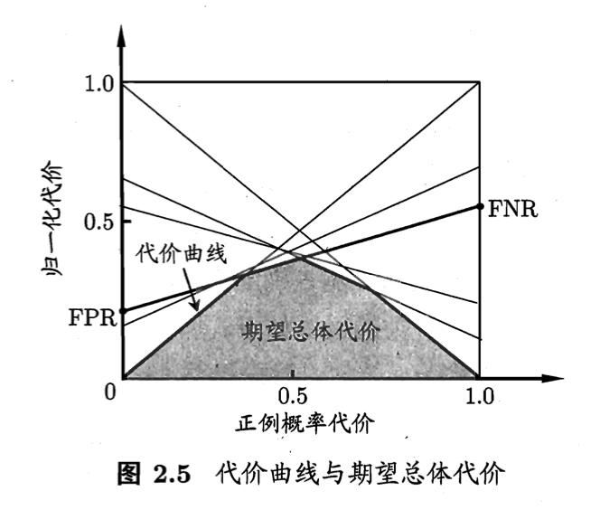

绘制方法：ROC曲线上每一点对应代价平面上的一条线段，对于坐标(TPR,FPR)，映射到线段(0,FPR)$\rightarrow$(1,FNR)，线段下的面积表示该条件下期望总体代价。

#### 比较检验（气氛概率论了起来）

##### 假设检验

检验误分类样本数

泛化错误率为$\epsilon$的学习器被测得测试错误率为$\hat{\epsilon}$的概率：
$$
P(\hat{\epsilon},\epsilon)={m\choose \hat{\epsilon}\times m}\epsilon^{\hat{\epsilon}\times m}(1-\epsilon)^{m-\hat{\epsilon}\times m}
$$
符合二项分布，可以使用二项检验进行对$\epsilon$值范围的假设检验，根据$1-\alpha$置信度

若使用多次重复留出法/交叉验证法进行多次训练/测试，会得到多个测试错误率，采用t-检验：
k个测试错误率：$\hat{\epsilon_{1}},\cdots,\hat{\epsilon_{k}}$，则由平均测试错误率$\mu$和方差$\sigma^{2}$构造随机变量：
$$
\tau_{t}=\frac{\sqrt{k}(\mu-\epsilon)}{\sigma}
$$
服从自由度为$k-1$的$t$分布

若$\mu$与$\epsilon_{0}$的差在临界值范围内，则接受原假设$\mu=\epsilon_{0}$

k折交叉验证进行成堆t-检验，对每对结果求差，计算差值的$\mu$和$\sigma^{2}$，新随机变量为：
$$
\tau_{t}=|\frac{\sqrt{k}\mu}{\sigma}|
$$
服从自由度$k-1$的t分布

此外还有McNemar检验，Friedman检验和Nemenyi检验

#### 偏差-方差分解

解释学习算法泛化性能——为什么

期望泛化误差$E(f;D)=bias^{2}(x)+var(x)+\epsilon^{2}$，即可分解为偏差/方差/噪声之和

偏差方差窘境，即存在冲突

- 误差：整个模型误差
- 偏差：模型在样本上的输出与真实值之间的误差（模型的拟合能力），预测结果与回归函数
- 方差：模型每一次输出结果与输出期望之间的误差（数据扰动影响），预测结果围绕均值
- 噪声：数据集中真实值与标记值的误差（问题的难度），任何算法在当前任务达到的期望泛化误差下界

给定测试数据$x$，令$t$为要预测的变量
条件期望（条件均值）
$$
h(x)=E(t|x)=\int t\cdot p(t)dt
$$

最小平方误差的期望损失：

$$
E(L)=\int[y(x)-h(x)]^{2}p(x)dx+\int [h(x)-t]^{2}p(x,t)dxdt
$$
$$
=E_{D}\{[y(x;D)-h(x)]^{2}\}+noice
$$

推导：
使用含有参数向量$w$的函数$y(x,w)$拟合$h(x)$，数据集D
在数据集上计算平均误差：
$$
E_{D}\{[y(x;D)-h(x)]^{2}\}=\{E_{D}[y(x;D)]-h(x)\}^{2}\qquad +\qquad E_{D}\{[y(x;D)-E_{D}[y(x;D)]^{2}\}$$$$=bias^{2}+variance
$$

- $(bias)^{2}=\int \{E_{D}[y(x;D)]-h(x)\}^{2}p(x)dx$
- $variance = \int E_{D}\{[y(x;D)-E_{D}[y(x;D)]^{2}\}p(x)dx$
- $noise =\int [h(x)-t]^{2}p(x,t)dxdt$

## 分类器类型

- 基于实例的分类器
    - 直接利用观察结果判断（不需要模型）
    - 例：k-近邻（取k个距离最小的点，投票选择）
- 判别式分类器
    - 直接估计决策规则/边界，具有一个threshold
    - 例：Logistic回归
- 生成式分类器
    - 构建数据的生成统计模型，求与不同label之间联合概率分布，投票制
    - 例：朴素贝叶斯

- 频率学派
    - 概率分布参数确定，可直接估计
    - 最大似然
- 贝叶斯学派
    - 不能确定数据用固定参数生成，由先验分布，实验过程调整自己假设，最后结果是后验分布
    - 最大后验

参数先验分布：$P(\theta)$
似然：$P(X|\theta)$
后验：$P(\theta|X) = \frac{P(X|\theta)P(\theta)}{P(X)}$


## 线性模型

### 线性回归
以线性形式给出数据集的预测，由$d$个属性描述的事例$x=(x_{1};\cdots;x_{d})$，$x_{i}$为$x$在第i个属性上的取值
线性模型：
$$
f(x)=\omega_{1}x_{1}+\cdots+\omega_{d}x_{d}+b
$$
一般用向量表示：
$$
f(x)=\omega^{T}x+b
$$

方法：线性回归
回归任务最常用性能度量：均方误差，对应欧几里得距离
方法为：最小二乘法，找到一条直线使样本到直线上欧式距离最小
求解过程：参数估计（联想概率论）

多元线性回归/对数线性回归/广义线性模型：单调可微函数

### 对数几率函数
对于单位阶跃函数的替代方式，将预测实值转化为0/1值：
$$
y=\frac{1}{1+e^{-z}}
$$
将z值转化为0/1附近的y值，且在$z=0$附近变化陡
此时有$\ln{\frac{y}{1-y}}=\omega^{T}x+b$
将y视为x作为正例的可能性，1-y是其反例的可能性，其比值$\frac{y}{1-y}$称为几率，反映x作为正例的相对可能性
对数几率：$\ln{\frac{y}{1-y}}$

事实上是用线性回归模型的预测结果逼近真实标记的对数几率
将y视为类后验概率估计$p(y=1|x)$
于是有：
$$p(y=1|x)=\frac{e^{\omega^{T}x+b}}{1+e^{\omega^{T}x+b}}$$

$$p(y=0|x)=\frac{1}{1+e^{\omega^{T}x+b}}$$

通过极大似然估计$\omega$和$b$
最大化似然函数：
$$
l(\omega,b)=\sum\limits_{i=1}{m}\ln{p(y_{i}|x_{i};\omega,b)}
$$
令$\beta=(\omega;b),\hat{x}=(x;1)$，则$\omega^{T}x+b=\beta^{T}\hat{x}$
因此等价于最小化：
$$
l(\beta)=\sum\limits_{i=1}^{m}(-y_{i}\beta^{T}\hat{x_{i}}+\ln{(1+e^{\beta^{T}\hat{x_{i}}})})
$$
这是关于$\beta$的高阶可导连续凸函数，由凸优化理论，梯度下降法、牛顿法可求其最优解

### 线性判别分析(LDA)

给定训练样例集，将其投影到一条直线上，使得同类样例的投影点尽可能接近，异类尽可能远离，新样本采取同样投影方式

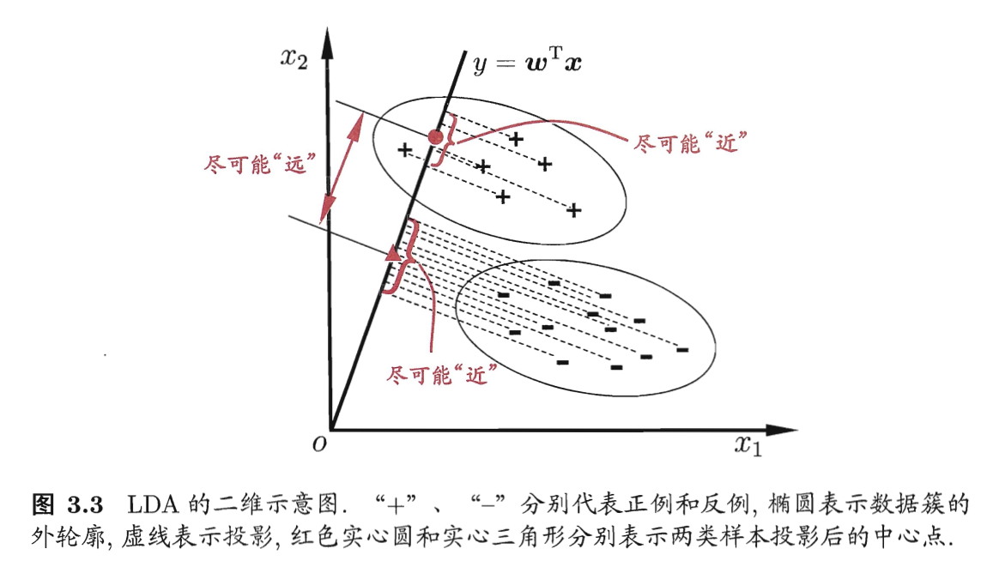

#### 二分类

给定数据集$D=\{(x_{i},y_{i})\}_{i=1}^{m},y_{i}\in \{0,1\}$，令$X_{i},\mu_{i},\sum_{i}$分别为第$i\in \{0,1\}$类事例的集合、均值向量、协方差矩阵。将数据投影到直线$\omega$上。
两类样本中心在直线上投影$\omega^{T}\mu_{0}$和$\omega^{T}\mu_{1}$
协方差为$\omega^{T}\Sigma_{0}\omega$和$\omega^{T}\Sigma_{1}\omega$
以上均为实数
因此任务是使$\omega^{T}\Sigma_{0}\omega+\omega^{T}\Sigma_{1}\omega$尽可能小；同时需要$||\omega^{T}\mu_{0}-\omega^{T}\mu_{1}||_{2}^{2}$尽可能大
同时考虑二者，最大化目标：
$$
J=\frac{||\omega^{T}\mu_{0}-\omega^{T}\mu_{1}||_{2}^{2}}{\omega^{T}\Sigma_{0}\omega+\omega^{T}\Sigma_{1}\omega}=\frac{\omega^{T}(\mu_{0}-\mu_{1})(\mu_{0}-\mu_{1})^{T}\omega}{\omega^{T}(\Sigma_{0}+\Sigma_{1})\omega}
$$

定义 类内散度矩阵：
$$
S_{\omega}=\Sigma_{0}+\Sigma_{1}=\sum\limits_{x\in X_{0}}(x-\mu_{0})(x-\mu_{0})^{T}+\sum\limits_{x\in X_{1}}(x-\mu_{1})(x-\mu_{1})^{T}
$$
类间散度矩阵：
$$
S_{b}=(\mu_{0}-\mu_{1})(\mu_{0}-\mu_{1})^{T}
$$
于是最大化目标可表示为：
$$
J=\frac{\omega^{T}S_{b}\omega}{\omega^{T}S_{\omega}\omega}
$$
这就是$S_{b}$与$S_{\omega}$的广义瑞利商

可确定$\omega=S_{\omega}^{-1}(\mu_{0}-\mu_{1})$
实际会对$S_{\omega}$进行奇异值分解，$S_{\omega}=U\Sigma V^{T}$，$\Sigma$为实对角矩阵，对角线元素为$S_{\omega}$的奇异值，$S_{\omega}^{-1}=V\Sigma^{-1}U^{T}$

LDA可从贝叶斯决策理论的角度阐释，当两类数据同先验、满足高斯分布且协方差相等时，LDA达到最优分类

#### 多分类任务

LDA可推广到多分类任务中，定义全局散度矩阵：
$$
S_{t}=S_{b}+S_{\omega}=\sum\limits_{i=1}^{m}(x_{i}-\mu)(x_{i}-\mu)^{T}
$$
其中$\mu$为所有实例的均值向量
类内散度矩阵为每个类别散度矩阵之和：$S_{\omega}=\sum\limits_{i=1}^{N}S_{\omega_{i}}$
其中，$S_{\omega_{i}}=\sum\limits_{x\in X_{i}}(x-\mu_{i})(x-\mu_{i})^{T}$
$$
\therefore S_{b}=S_{t}-S_{\omega}=\sum\limits_{i=1}^{N}m_{i}(\mu_{i}-\mu)(\mu_{i}-\mu)^{T}
$$
采用优化目标：
$$
\max\limits_{W}{\frac{tr(W^{T}S_{b}W)}{tr(W^{T}S_{\omega}W)}}
$$
其中$W\in \mathbb{R}^{d\times (N-1)}$
可通过广义特征值问题求解：$S_{b}W=\lambda S_{\omega}W$

### 多分类学习

基于基本策略，利用二分类学习器来解决多分类问题

考虑$N$个类别$C_{1},\cdots,C_{N}$，多分类学习的基本思路是拆解法，拆分为若干个二分类任务求解，为每个二分类任务训练一个分类器；测试时对预测结果集成得到最终多分类结果。

拆分策略，经典策略：一对一OvO，一对其余OvR，多对多MvM

给定数据集$D=\{(x_{1},y_{1}),\cdots, (x_{m},y_{m})\}$，$y_{i}\in \{C_{1},\cdots , C_{N}\}$.

OvO将$y_{i}$所属的这$N$个类别两两配对，从而产生$\frac{N(N-1)}{2}$个二分类任务，对每一对任务(如$C_{i},C_{j}$)训练一个分类器；
测试阶段，新样本交给所有分类器，于是得到$N(N-1)/2$个分类结果，最终结果通过*投票*(?)产生，将预测最多的类别作为最终的分类结果。

OvR为每次将一个类的样例作为正例、所有其他类作为反例训练$N$个分类器。在测试时若仅有一个分类器预测为正类，则对应的类别标记为最终结果，若有多个预测为正类，则考虑置信度，取最高者。

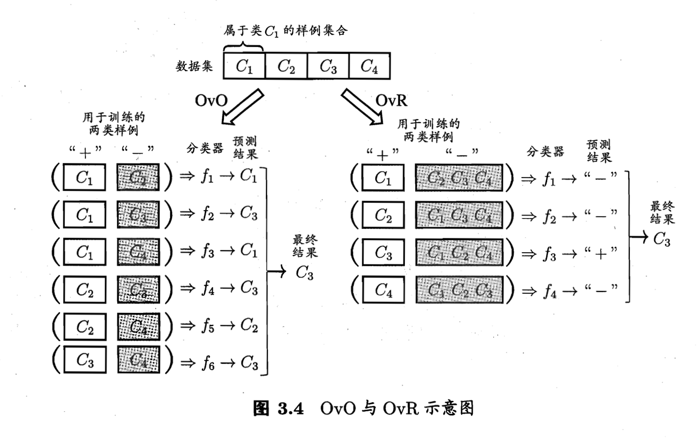

可以据图比较OvO和OvR的存储/测试时间开销，训练时间开销

MvM:每次将若干个类分为正类，其余若干类分为反类，所以事实上OvO和OvR为其特例；
正反例构造有特殊设计，最常用技术：`纠错输出码`(ECOC)，引入编码的思想

- 编码：对$N$个类别做$M$次划分，每次划分将一部分化为正类，一部分化为反类，从而形成一个二分类训练集；共产生$M$个训练集，$M$个分类器
- 解码：$M$个分类器对测试样本预测，预测标记组成编码，与每个类各自的编码比较，返回距离最小的类别作为最终预测结果

类别划分通过`编码矩阵`指定，编码矩阵有多种形式，常见的有二元码(正类/反类）和三元码(正类/反类/停用类)，

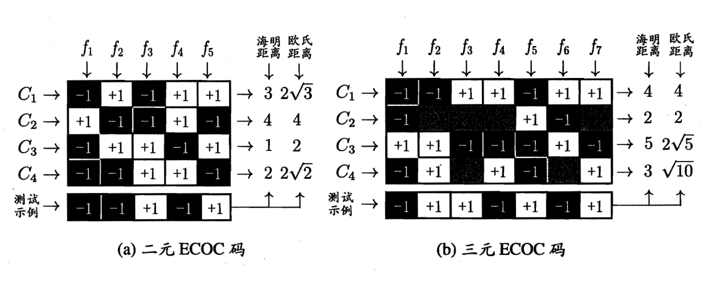

选取最小的欧式距离

测试阶段，ECOC编码对分类器对错误有一定的容忍/修正，一般ECOC编码越长，纠错能力越强，但计算、存储开销会增大。考虑因素很多，并不一定选用理论纠错性质最好的编码

### 类别不平衡问题

以上分类学习方法共同假设：不同类别训练样例数目相当

类别不平衡：分类任务中不同类别训练样例树木差别很大。

假定正类样例数少，不失一般性

例如线性分类器：$y=\omega^{T}x+b$对新样本$x$分类，若$\frac{y}{1-y}>1$，预测为正例

当正反例数目不同时，令$m^{+}$为正例数目，$m^{-}$为反例数目，观测几率为$\frac{m^{+}}{{m^{-}}}$，于是若$\frac{y}{1-y}>\frac{m^{+}}{m^{-}}$，则预测为正例

但决策基于前面预测值，因此使用`再缩放`，令$\frac{y'}{1-y'}=\frac{y}{1-y}\times \frac{m^{-}}{m^{+}}$**(*)**

现实中真实的无偏采样很难做到，所以基于训练集观测几率推断真实几率很难做到

技术上三类做法：
- 欠采样，去除一些反例
- 过采样，增加一些正例
    - 代表性算法：SMOTE
- 将**(*)**式应用到原始训练集训练出的分类器中，进行`阈值移动`


## 决策树

### 基本流程

通常一棵决策树包含一个根结点、若干内部结点和若干叶结点；
叶结点对应决策结果，为落入该分类中最多的结果，其他结点对应一个属性测试；
每个结点包含的样本集合根据熟悉测试的结果被划分到子结点中，根结点包含样本全集
从根结点到每个叶结点的路径对应一个判定测试序列

决策树学习目的：产生一棵泛化能力强的决策树

选择根结点属性：贪心算法
- 最大化信息增益，最小化条件信息熵
    - 目标Y，条件属性X，计算$H(Y|X)$

基本流程采用`分而治之`策略：

**输入**：训练集$D=\{(x_{1},y_{1}),\cdots,(x_{m},y_{m})\}$

```
过程：函数TreeGenerate(D,A)
1: 生成结点node:
2: if D中样本全属于同一类别C then
3:      将node标记为C类结点; return
4: end if
5: if A = $\varnothing$ OR D中样本在A上取值相同 then
6:      将node标记为叶结点，其类别标记为D中样本最多的类; return
7: end if
8: 从A中选择最优划分属性$a_{*}$
9: for $a_{*}$的每个值$a_{*}^{v}$ do
10:     为node生成一个分支；令$D^{v}$表示$D$中在$a_{*}$上取值为$a_{*}^{v}$的样本子集；
11:     if $D^{v}$为空 then
12:         将分支结点标记为叶结点，其类别标记为$D$中样本最多的类;return
13:     else
14:         以TreeGenerate($D^{v}$,A\$\{a_{*}\}$)为分支结点
15:     end if
16: end for
```

**输出**：以node为根结点的一棵决策树


<center><b>算法Decision Tree决策树学习基本算法</b></center>
<br>

决策树生成为递归过程，在算法中有三种情况会导致递归返回：
1. 当前结点包含的样本全属于同一类别，无需划分
2. 当前属性集为空，或所有样本在所有属性上取值相同，无法划分
3. 当前结点包含的样本集合为空，不可划分

在[2]下将当前结点标记为叶结点，类别设定为该结点所含样本最多的类别
[3]下同样标记为叶结点，但类别设定为父结点所含样本最多的类别

注意上两种处理实质不同：[2]在利用当前结点的后验分布，[3]则吧父结点的样本分布作为当前结点的先验分布

### 划分选择

注意到在决策树学习算法中最关键的为第8行，即如何选择最优划分属性
目标：随着划分过程不断进行，希望决策树分支结点所包含样本尽可能属于同一类别，即结点`纯度`不断提高

#### 信息增益

`信息熵`：度量样本集合纯度的常用指标
设当前样本集合$D$中第$k$类样本所占的比例为$p_{k}(k=1,2,\cdots,|Y|$，则$D$的信息熵定义为：
$$
Ent(D)=\sum\limits_{k=1}^{|Y|} p_{k}\log_{2} p_{k}
$$
熵即混乱度，故$Ent(D)$值越小，$D$纯度越高

Entropy Name|Entropy
:-:|:-:
Shannon Entropy|$$H_{sha}=\sum\limits_{i=1}^{m}p_{i}\log_{2}{\frac{1}{p_{i}}}$$
Pal Entropy|$$H_{pal}=\sum\limits_{i=1}^{m}p_{i}e^{1-p_{i}}$$
Gini Entropy|$$H_{gini}=\sum\limits_{i=1}^{m}p_{i}(1-p_{i})$$
Goodman-Kruskal Entropy|$$H_{goo}=1-\max\limits_{i=1 \& i<m}p_{i}$$

`条件信息熵`：在其他随机变量的条件下预测某随机变量的难度
$$
H(Y|X)=\sum\limits_{i=1}^{n}p(x_{i})H(Y|x_{i})
$$
假定离散属性$a$有$V$个可能的取值$\{a^{1},\cdots, a^{V}\}$，若使用$a$对样本集$D$进行划分，则产生$V$个分支结点，其中第$v$个分支结点包含了$D$在所有属性$a$上取值$a^{v}$的样本，记为$D^{v}$，于是可根据定义式求得$D^{v}$的信息熵。

考虑到不同分支结点所包含样本数不同，对其赋予权重$\frac{|D^{v}|}{|D|}$，样本数更多的分支结点影响++，于是可计算属性$a$对样本集$D$进行划分所获`信息增益`：
$$
Gain(D,a)=Ent(D)-\sum\limits_{v=1}^{V}\frac{|D|}{D}Ent(D^{v})
$$
度量X对预测Y的增益：
$$
Gain(X,Y)=H(Y)-H(Y|X)
$$
可以保证$H(Y|X)<H(Y)$

意义：信息增益越大，使用属性$a$来进行划分得到的`纯度提升`越大，因此可利用信息增益来进行决策树的划分属性选择。
即：在算法Decision Tree第八行选择属性$a_{*}=\arg\max\limits_{a\in A} Gain(D,a)$

> ID3决策树学习算法[Quinlan, 1986]，以信息增益为准则选择划分属性

#### 增益率

> C4.5决策树算法[Quinlan, 1993]不直接使用信息增益，而使用增益率来选择最优划分属性

增益率(Gain Ratio)定义为：
$$
Gain\_ratio(D,a)=\frac{Gain(D,a)}{IV(a)}
$$
其中，
$$
IV(a)=-\sum\limits_{v=1}^{V}\frac{|D^{v}|}{|D|}\log_{2}\frac{|D^{v}|}{|D|}
$$
称为属性$a$的固有值(intrinsic value)，属性$a$的可能取值越多($V$越大)，则$IV(a)$的值通常会越大å

**注意**：增益率准则对可取值数目少的属性偏好，`C4.5`算法不是直接选择增益最大的候选项目划分属性，而是使用启发式：先从候选划分属性中找出信息增益高于平均水平的属性，再从中选择增益率最高的*(?)*

#### 基尼系数

> CART决策树[Breiman et al., 1984]使用`基尼指数`(GIni index)来选择划分顺序

数据集$D$的纯度可用基尼值来衡量：
$$
\begin{align}Gini(D)= & \sum\limits_{k=1}^{|Y|}\sum\limits_{k'\neq k} p_{k} p_{k'} \\  & =1-\sum\limits_{k=1}^{|Y|} p_{k}^{2} \end{align}
$$
直观而言，$Gini(D)$反映了数据集$D$中随机抽取两个样本，类别标记不一致的概率

因此$Gini(D)$越小，数据集$D$的纯度越高

属性$a$的基尼指数定义为：
$$
Gini\_index(D,a)=\sum\limits_{v=1}^{V} \frac{|D^{v}|}{|D|}Gini(D^{v})
$$
于是在候选属性集合$A$中，选择使划分后基尼指数最小的属性为最优划分属性，即$a_{*}=\arg\max\limits_{a\in A}Gini\_index(D,a)$

### 剪枝

剪枝(pruning)在决策树学习算法中应对`过拟合`，有时可能决策树分支过多，可能因训练太好以至于把训练集自身的一些特点当作所有数据都具有的一般性质而导致过拟合，通过主动剪枝可降低风险

剪枝基本策略有`预剪枝`，`后剪枝`
- 预剪枝：在决策树生成过程中，对每个结点在划分前进行估计，若当前结点对划分不能带来决策树泛化性能提升，则停止划分并将当前结点标记为叶结点
- 后剪枝：先从训练集生成一颗完整的决策树，然后自底向上对非叶结点进行考察，若该结点子树替换为叶结点能带来决策树泛化性能提升，则将子树替换为叶结点

确定泛化性能是否得到提升，采用2.2[评估方法]所给出的方法即可

#### 预剪枝

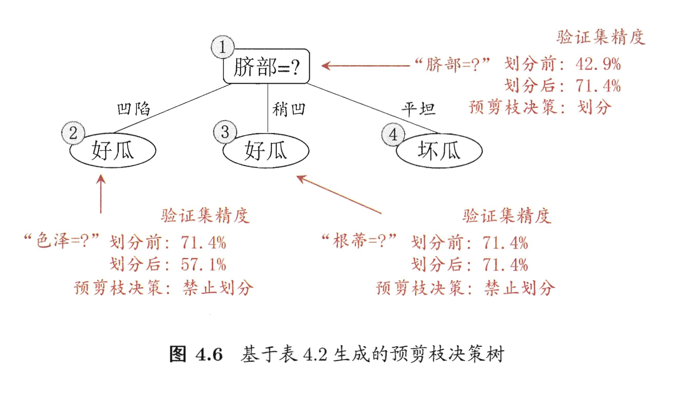

判断泛化性能方法：留出法，使用`验证集`进行性能评估，考虑验证集精度

仅有一层划分的决策树，称为`决策树桩`

虽然降低过拟合的风险，显著减小了各种开销，但有些分支不展开的划分并不能提升泛化性能，由于`贪心`的本质，预剪枝决策树有欠拟合的风险

#### 后剪枝

例：后剪枝决策树：

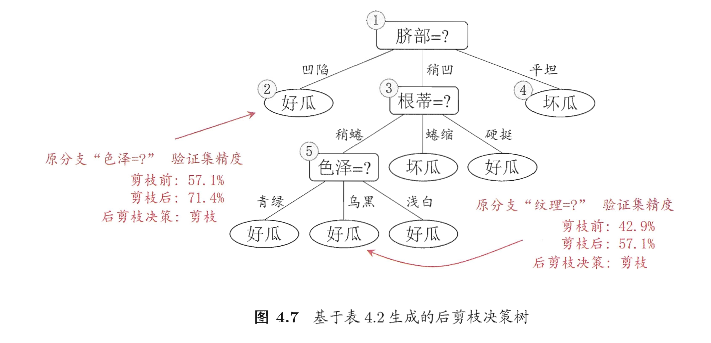

后剪枝决策树通常比预剪枝决策树保留更多的分支，欠拟合风险很小，泛化性能更优，但自底向上，开销更大。

### 连续与缺失值

#### 连续值

连续属性离散化，二分法-最易
> C4.5决策树算法采用

给定样本集$D$和连续属性$a$，假定$a$在$D$上存在$n$个不同取值，进行排序，记为$\{a^{1},\cdots,a^{n}\}$

基于划分点$t$可将$D$分为子集$D_{t}^{-}$和$D_{t}^{+}$，其中$D_{t}^{-}$包含那些在属性$a$上取值不大于$t$的样本，$D_{t}^{+}$包含在属性$a$上大于$t$的样本

对相邻的属性取值$a^{i},a^{i+1}$来说，$t$在区间$[a^{i},a^{i+1})$中取任意值所产生的划分结果相同

对连续属性$a$，可考察包含$n-1$个元素的候选划分集合：
$$
T^{a}=\{ \frac{a^{i}+a^{i+1}}{2} | 1\leqslant i \leqslant n-1\}
$$
即把区间$[a^{i},a^{i+1})$中位点$\frac{a^{i}+a^{i+1}}{2}$作为候选划分点

于是对增益求解式稍加改造，可得：
$$
\begin{align}Gain(D)= & \max\limits_{t\in T_{a}} Gain(D,a,t)\\ & =\max\limits_{t\in T_{a}} Ent(D,a,t)-\sum\limits_{\lambda \in \{-,+\}} \frac{|D_{t}^{\lambda}|}{|D|}Ent(D_{t}^{\lambda}) \end{align}
$$
#### 缺失值

解决问题：
1. 如何在属性值确实情况下进行划分属性选择
2. 给定划分属性，若样本值缺失，如何划分样本

给定训练集$D$与属性$a$，$\tilde{D}$表示$D$在属性$a$上没有缺失值的样本子集，仅能通过$\tilde{D}$判断属性$a$优劣
假定$a$有$V$个取值$\{a^{1},\cdots, a^{V}\}$，$\tilde{D}^{v}$表示$\tilde{D}$在属性$a$上取值为$a^{v}$的样本子集，$\tilde{D}_{k}$表示$\tilde{D}$中属于第$k$类$(k=1,2,\cdots,|Y|)$的样本子集
于是有，$\tilde{D}=\bigcup_{k=1}^{|Y|}\tilde{D}_{k}$，$\tilde{D}=\bigcup_{v=1}^{V}\tilde{D}_{v}$

对每个样本$x$赋权$\omega_{x}$：
$$
\rho=\frac{\sum_{x\in \tilde{D}} \omega_{x}}{\sum_{x\in D} \omega_{x}}$$$$\tilde{p_{k}}=\frac{\sum_{x\in \tilde{D_{k}}} \omega_{x}}{\sum_{x\in D} \omega_{x}}
$$
$$
\tilde{r_{v}}=\frac{\sum_{x\in \tilde{D^{v}}} \omega_{x}}{\sum_{x\in D} \omega_{x}}
$$
即对属性$a$，$\rho$表示无缺失样本所占比例，$\tilde{p_{k}}$表示无缺失样本第$k$类所占比，$\tilde{r^{v}}$表示取值为$a^{v}$样本所占比

新信息增益公式：
$$
\begin{align}Gini(D)= & \rho\times Gain(\tilde{D},a)\\ & = \rho\times (Ent(\tilde{D})-\sum\limits_{v=1}^{V}\tilde{r_{v}} Ent(\tilde{D^{v}})) \end{align}
$$
而
$$
Ent(\tilde{D})=-\sum\limits_{k=1}^{|Y|}\tilde{p_{k}}\log_{2}\tilde{p_{k}}
$$
对问题2，若样本$x$在划分属性$a$上取值已知，则将其划入与取值对应的子结点，且样本权值在子结点中仍为$\omega_{x}$；
若样本在划分属性上取值未知，则将其划入所有子结点，样本权值在属性值$a^{v}$对应子结点中调整为$\tilde{r_{v}}\cdot \omega_{x}$。即，让同一样本以不同概率划入不同子结点

### 多变量决策树

将每个属性视为坐标空间中一个坐标轴，则$d$个属性所描述的样本对应$d$维空间一个数据点，于是分类任务为在坐标空间中寻找分类边界。决策树所形成的分类边界特点：轴平行，分类边界每一段都与坐标轴平行，学习结果具有较好可解释性

多变量决策树实现斜划分，非叶结点不再是某个属性，而是属性的线性组合
非叶结点形如$\sum\limits_{i=1}^{d}\omega_{i}a_{i} = t$的线性分类器，$\omega_{i}$为属性$a_{i}$的权重，$\omega_{i}$和$t$可在结点所含样本集与属性集上学得。

因此多变量决策树学习，不是为非叶结点寻求最优划分属性，而是建立何时线性分类器

## 神经网络

### 神经元模型

M-P神经元模型：
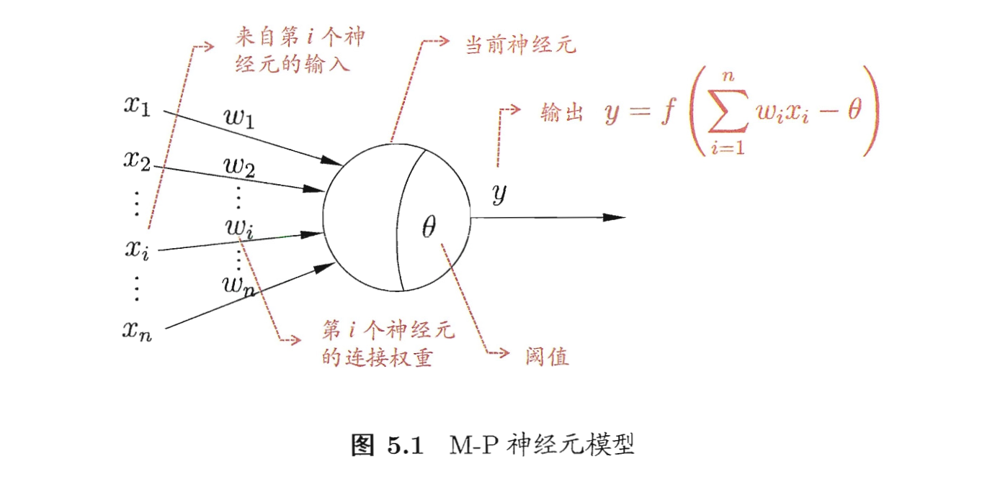

神经元(neuron)接收到的总输入值与神经元阈值比较，通过激活函数处理产生输出
理想的激活函数为阶跃函数，0-神经元兴奋，1-抑制，但不连续、不光滑，使用Sigmoid函数替代，将较大范围内变化的输入值压缩到$(0,1)$输出值范围中：

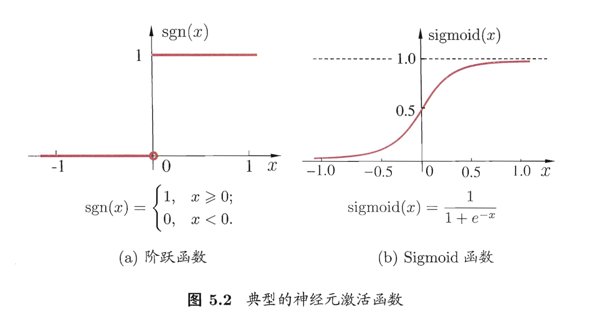

Sigmoid函数有一个很好的性质：
$$
f'(x) = f(x)(1-f(x))
$$
### 感知机与多层网络

感知机(perceptron)由两层神经元构成

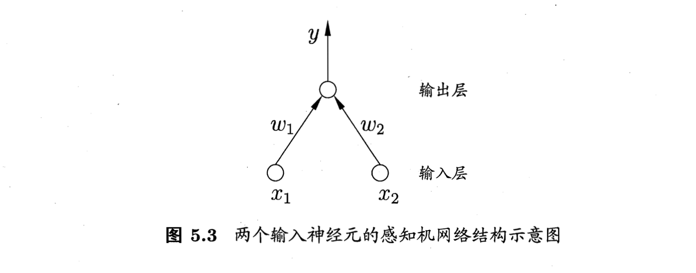

方便进行与或非运算

一般的，给定训练数据集，权重$\omega_{i}$与阈值$\theta$可通过学习得到。
阈值$\theta$可看作固定输入为$-1.0$的哑结点所对应新权重$\omega_{n+1}$，因此可统一视作权重学习

对训练样例$(x,y)$，若当前感知机输出为$\hat{y}$，调整感知机
$$
\omega_{i}\leftarrow \omega_{i} + \Delta omega_{i}
$$

$$
\Delta omega_{i} = \eta (y-\hat{y})x_{i}
$$
$\eta\in (0,1)$称为学习率，若预测正确，则不变化，而根据错误程度调整权重

感知机只有输出层神经元进行激活函数处理，学习能力有限。与或非问题为线性可分问题，若两类模式线性可分，则存在一个线性超平面分开它们，则感知机的学习过程一定会收敛，即可求得适当的权向量$\omega = (\omega_{1};\cdots;\omega_{n+1})$；否则，感知机学习过程发生震荡

输出是把输入压扁的线性函数：
$$
y=f(x) = sgn(\sum\limits_{i=1}^{d} x_{i}\omega_{i}-\omega_{0})
$$
解决非线性可分：多层功能神经元，输出层与输入层之间为隐含层，隐含层与输出层神经元都拥有激活函数

用梯度下降法训练单层感知机：

- 输入$x$、输出$y$以及真实标签$d$的平方误差：
$$
E = \frac{1}{2}(d-y)^{2} = \frac{1}{2}(d-f(x))^{2}
$$
误差对权重的导数：
$$
\frac{\partial E}{\partial \omega_{i}} = -(d-f(x))f^{\prime}(x)x_{i}
$$
通过梯度下降法寻找最优数值解：
$$
\omega_{j}\leftarrow \omega_{i} + \alpha(d-f(x))f^{\prime}(x)x_{i}
$$
其中$\alpha$为学习率

多层前馈神经网络：每层与下一层完全互联，神经元之间不存在同层、跨层连接
（前馈指不存在回路）

### 误差逆传播算法(BackPropagation, BP)

BP算法可用于多种神经网络

给定训练集$D=\{(x_{1},y_{1}),\cdots,(x_{m},y_{m}\},x_{i}\in \mathbb{R}^{d},y_{i}\in \mathbb{R}{l}$
即输入实例由$d$个属性描述，输出$l$维实向量，舍隐层神经元有$q$个，输出层神经元阈值为$\theta_{j}$，隐层神经元阈值$\gamma_{h}$，输入层与隐层神经元连接权$v_{ih}$，隐层与输出层连接权$\omega_{hj}$；
于是隐层（$h$个）神经元接收到的输入$\alpha_{h}=\sum_{i=1}^{d}v_{ih}x_{i}$，输出层第$j$个神经元输入$\beta_{j}=\sum_{h=1}^{q}\omega_{hj}b_{h}$

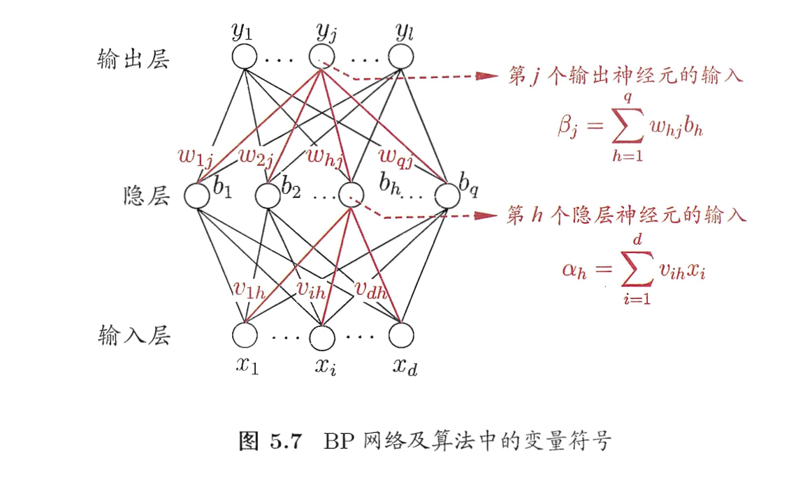

训练例$(x_{k},y_{k})$，神经网络输出$\hat{y_{k}}=(\hat{y_{1}}^{k},\cdots,\hat{y_{l}}^{k})$
$$
\hat{y_{j}}^{k}=f(\beta_{j}-\theta_{j})
$$
则在训练例上的均方误差
$$
E_{k} = \frac{1}{2}\sum\limits_{j=1}{l}(\hat{y_{j}}^{k}-y_{j}^{k})^{2}
$$
图中网络有$(d+l+1)q+l$个参数需要确定

BP迭代学习算法，迭代每一轮采用广义感知机学习规则更新参数估计，$v\leftarrow v+\Delta v$

以隐层到输出层连接权$\omega_{hj}$为例
BP算法基于梯度下降策略，以目标负梯度方向对参数进行调整，对误差$E_{k}$给定学习率$\eta$：
$$
\Delta \omega_{hj}=-\eta \frac{\partial E_{k}}{\partial \omega_{hj}}
$$
而$\omega_{hj}$先影响到第$j$个输出层神经元的输入值$\beta_{j}$，在影响到输出值$\hat{y_{j}}^{k}$，而后影响到$E_{k}$
$$
\frac{\partial E_{k}}{\partial \omega_{hj}} = \frac{\partial E_{k}}{\partial \hat{y_{j}}^{k}}\cdot \frac{\partial \hat{y_{j}}^{k}}{\partial \beta_{j}} \cdot \frac{\partial \beta_{j}}{\partial \omega_{hj}}
$$
根据$\beta_{j}$定义：
$$
\frac{\partial \beta_{j}}{\partial \omega_{hj}} = b_{h}
$$
令
$$
g_{j} = -\frac{\partial E_{k}}{\partial \hat{y_{j}}^{k}}\cdot \frac{\partial \hat{y_{j}}^{k}}{\partial \beta_{j}} = \hat{y_{j}}^{k}(1-\hat{y_{j}}^{k})(y_{j}^{k}-\hat{y_{j}}^{k})
$$
于是最终得
$$
\Delta \omega_{hj} = \eta g_{j} b_{h}
$$
类似，有：
$$
\Delta \theta_{j} = -\eta g_{j}
$$
$$
\Delta v_{ih} = \eta e_{h} x_{i}
$$
$$
\delta \gamma_{h} = -\eta e_{h}
$$
注：
$$
e_{h} = -\frac{\partial E_{k}}{\partial b_{h}}\cdot \frac{\partial b_{h}}{\partial \alpha_{h}} = b_{h}(1-b_{h})\sum\limits_{j=1}^{l}\omega_{hj}g_{j}
$$
学习率控制算法每轮迭代更新步长

标准BP算法：
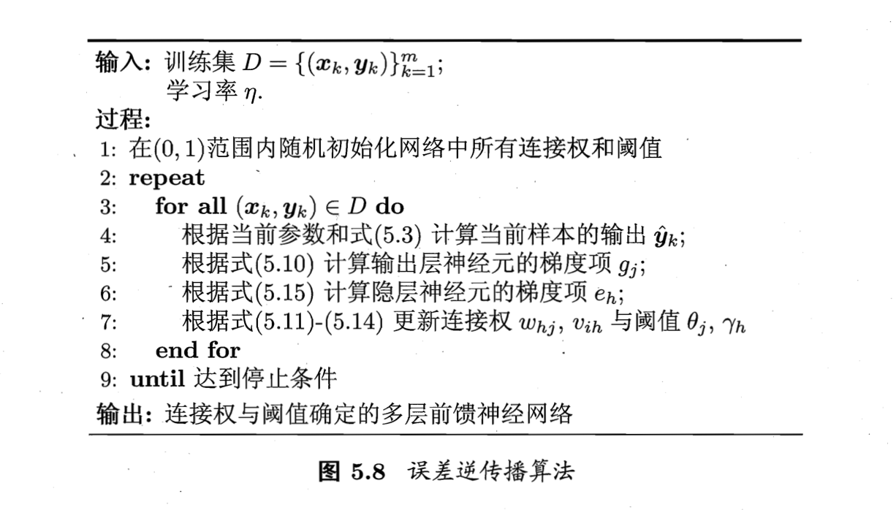

BP算法目标：最小化训练集$D$上累积误差：
$$
E = \frac{1}{m}\sum\limits_{k=1}^{m} E_{k}
$$
标准BP算法进行更多次数迭代，对每个样例都更新参数；
累积BP算法遍历整个训练集D一遍后才更新参数

problem：设置隐层神经元个数
采用试错法

经常遭遇过拟合，解决方法
1. 早停，将数据划分训练集与验证集，前者计算梯度、更新连接权与阈值，后者估计误差，若训练集误差降低而验证集误差胜过则停止训练
2. 正则化，在误差目标函数中增加一个用于描述网络复杂度的部分，例如连接权与阈值平方和
误差目标函数：
$$
E=\lambda \frac{1}{m}\sum\limits_{k=1}^{m}E_{k}+(1-\lambda)\sum\limits_{i}\omega_{i}^{2}
$$
其中$\lambda\in(0,1)$用于经验误差与网络复杂度折中，通过交叉验证法（划分训练、验证集）估计

### 全局最小与局部最小

若用$E$表示神经网络在训练集上的误差，则它显然关于连接权$\omega$和阈值$\theta$的函数
因此训练过程求解最优参数，使得$E$最小

局部极小与全局最小

跳出局部极小，接近全局极小：
- 以多组不同参数值初始化多个神经网络，按标准方法训练后，误差最小的解作为最终参数，从多个不同的初始点开始搜索
- 使用**模拟退火**，每一步都以一定概率接受比当前解更差的结果，从而有助于跳出局部极小，在每步迭代中，接受次优解概率需逐渐降低，保证稳定性
- 使用随机梯度下降，计算梯度加入随机因素，可能在局部极小点梯度不为零

+遗传算法，注意上述技术为启发式，理论上缺乏保障

### 其他常见神经网络模型

1. RBF网络，径向基函数，单隐层前馈
2. ART网络，自适应谐振理论，竞争型学习（无监督）
3. SOM网络，自组织，竞争型，能将高维数据映射到低维空间
4. 级联相关网络，结构自适应网络（同时也学习网络结构）
5. Elman网络，递归神经网络，允许出现环形结构，将一些神经元输出作为输入，能处理与时间有关的动态变
6. Boltzmann机，基于能量的模型，网络的能量，最小时最优，显层（表示数据输入和输出），隐层（数据内在表达）。标准B机为全连接图，复杂度高，受限B机仅保留显层与隐层间的连接，为二部图

### 深度学习

深层神经网络，增加隐层的深度
无监督逐层训练，训练每层隐结点将上层隐结点作为输入，预训练，微调训练
权共享，一组神经元使用相同连接权，卷积神经网络CNN

手写数字识别：
复合多个卷积层(convolution)与采样层(池化，pooling)对输入信号加工，在连接层实现与输出目标之间映射
每个卷积层包含多个特征映射（有多个神经元构成的平面，通过卷积滤波器提取输入特征）

### RNN


## 支持向量机

### 间隔与支持向量

给定训练样本集$D=\{(x_{1},y_{1}),\cdots,(x_{m},y_{m})\},y_{i}\in\{-1,+1\}$

分类学习基于训练集$D$在样本空间中找到划分超平面，分类不同类别样本
但满足的超平面很多，直观看应选择最正中间的划分超平面，分类结果最鲁棒，泛化能力最强

划分超平面可用线性方程描述：
$$
\omega^{T}x+b=0
$$
其中$\omega = (\omega_{1};\cdots;\omega_{d})$为法向量，决定超平面的方向；$b$为位移项，决定超平面与原点之间的距离，因此超平面可表示为$(\omega,b)$

对于$\lambda\neq 0$，$(\lambda\omega,\lambda b)$表示的是同一个超平面，因此可以选取适当的$\lambda$，使得最接近超平面的点满足$|\omega^{T}x+b|=1$，超平面为典型分类超平面

样本空间任意点$x$到超平面距离：
$$
r=\frac{|\omega^{T}+b}{||\omega||}
$$
假设超平面$(\omega,b)$能将训练样本分类正确，即对于$(x_{i},y_{i})\in D$，$y_{i}=1$的点在超平面上方，否则在下方，令
$$
\begin{cases} &\omega^{T}x_{i}+b\geqslant +1,y_{i}=+1; \\ &\omega^{T}x_{i}+b\leqslant -1,y_{i}=-1 \end{cases}
$$
距离超平面最近的几个训练样本点使等号成立，被称为**支持向量**，两个异类支持向量到超平面距离之和为
$$
\gamma = \frac{2}{||\omega||}
$$
被称为间隔(Margin)：离超平面最近的样本点到超平面的距离，间隔越大泛化能力越强。

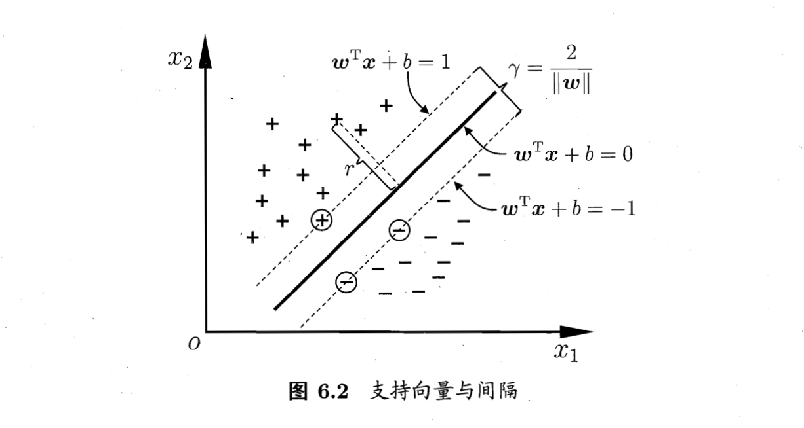

欲找到最大间隔划分超平面，即求
$$
\max\limits_{\omega,b} \frac{2}{||\omega||},s.t. \, y_{i}(\omega^{T}x_{i}+b)\geqslant 1, i=1,\cdots,m
$$
这等价于：
$$
\min\limits_{\omega,b} \frac{1}{2} ||\omega||^{2},(*)s.t. \, y_{i}(\omega^{T}x_{i}+b)\geqslant 1, i=1,\cdots,m
$$
即为支持向量机(SVM)基本型，二次规划问题

### 对偶问题

强对偶定理：
对于原始问题：
$$
\begin{align*} \min\limits_{\omega} & f(\omega) \\ s.t. &g_{i}(\omega)\leqslant 0,i=1,\cdots,k \\ & h_{i}(\omega) = 0, i=1,\cdots, l \end{align*}
$$
由拉格朗日乘子法：
$$
\begin{cases} & \min\limits_{\omega} \max\limits_{\alpha,\beta,\alpha_{i}\geqslant 0} L_{p}(\omega,\alpha,\beta)  \\ & L_{p}(\omega,\alpha,\beta) = f(\omega) + \sum\limits_{i=1}^{k} \alpha_{i}g_{i}(\omega) + \sum\limits_{i=1}^{l} \beta_{i}h_{i}(\omega) \end{cases}
$$
若以下三个定理成立，那么就存在一组$\omega{^*},\alpha{^*},\beta{^*}$，其中$\omega{^*}$为原始问题的最优解，$\alpha{^*},\beta{^*}$为对偶问题最优解

- $f(\omega),g_{i}(\omega)$为关于$\omega$的凸函数
- $h_{i}(\omega)$为仿射函数，即为$\omega$的线性函数
- $\exists \omega_{0},\forall i,g_{i}(\omega)<0$

对偶问题：
$$
\max\limits_{\alpha,\beta,\alpha_{i}\geqslant 0} \min\limits_{\omega} L_{p}(\omega,\alpha,\beta) 
$$
(\*)式本身为凸二次规划问题，可利用现成的优化计算包求解

对(\*)式使用拉格朗日乘子法得到**对偶问题**。对(\*)式每条约束添加拉格朗日乘子$\alpha_{i}\geqslant 0$，则拉格朗日函数：
$$
L(\omega,b,\alpha) = \frac{1}{2}||\omega||^{2}+\sum\limits_{i=1}^{m}\alpha_{i}(1-y_{i}(\omega^{T}x_{i}+b))
$$
其中$\alpha = (\alpha_{1};\cdots;\alpha_{m})$，令$L(\omega,b,a)$对$\omega$和$b$的偏导为零可得：
$$
\omega = \sum\limits_{i=1}^{m} \alpha_{i} y_{i} x_{i}$$$$0 = \sum\limits_{i=1}^{m} \alpha_{i}y_{i}
$$
(\*)式的对偶问题：
$$
\max\limits_{\alpha} \sum\limits_{i=1}^{m} \alpha_{i}-\frac{1}{2} \sum\limits_{i=1}^{m}\sum\limits_{j=1}^{m}\alpha_{i}\alpha_{j}y_{i}y_{j}x_{i}^{T}x_{j},(**)
$$

$$
s.t. \, \sum\limits_{i=1}^{m} \alpha_{i}y_{i} = 0, \alpha_{i}\geqslant 0, i = 1,2,\cdots,m
$$
解出$\alpha$后，求出$\omega$与$b$即可得模型：
$$
f(x) = \omega^{T}x+b=\sum\limits_{i=1}^{m} \alpha_{i}y_{i}x_{i}^{T}x+b
$$
解出的$\alpha_{i}$为拉格朗日橙子，对应着第i个训练样本，注意(*)式有不等式约束，因此上述过程需满足KKT条件：
$$
\begin{cases} & \alpha_{i}\geqslant 0; \\ & y_{i}f(x_{i})-1\geqslant 0; \\ & \alpha_{i}(y_{i}f(x_{i})-1)=0 \end{cases}
$$
由此，对训练样本$(x_{i},y_{i})$，总有$\alpha_{i}=0$或$y_{i}f(x_{i})=1$，若前者，则样本不会出现在求和式；若后者，则对应样本点位于最大间隔边界上，为支持向量；

因此，支持向量机重要性质：训练完成后，大部分样本不需保留，最终模型仅与支持向量有关

求解(\*\*)式：二次规划，高效算法：SMO，基本思路：首先固定$\alpha_{i}$之外的所有参数，然后求$\alpha_{i}$上的极值，由于存在约束$\sum\limits_{i=1}^{m}\alpha_{i}y_{i}=0$，因此仅固定$\alpha_{i}$也可由其他变量导出；因此每次选择两个变量$\alpha_{i},alpha_{j}$，固定其他参数；重复下列步骤：
- 选取一堆需更新的变量$\alpha_{i},\alpha_{j}$
- 固定它们以外的参数，求解(\*\*)，获得更新后的$\alpha_{i},\alpha_{j}$

SMO采用了一个启发式：选取两变量所对应样本之间间隔最大

### 核函数

在现实任务中，原始样本空间也许并不存在一个正确划分两类样本的超平面

可将样本从原始空间映射到更高维的特征空间，使得在特征空间内样本线性可分

若原始空间有限维（属性数有限），则一定存在一个高维特征空间使样本可分

令$\phi(x)$表示$x$映射后的特征向量

则将上节模型$x$替换为$\phi(x)$即可

但在对偶问题中会求$\phi(x_{i})^{T}\phi(x_{j})$，即样本$x_{i},x_{j}$映射到特征空间之后的内积，但通常困难
设想函数：
$$
kappa(x_{i},x_{j})=<\phi(x_{i},x_{j})>=\phi(x_{i})^{T}\phi(x_{j})
$$
即$x_{i},x_{j}$在特征空间的内积等于在原始样本空间中通过函数$\kappa(\cdot,\cdot)$计算的结果，于是不必计算无穷维特征空间中的内积

求解对偶问题可得：
$$
f(x) = \omega^{T} \phi(x) + b = \sum\limits_{i=1}^{m} \alpha_{i}y_{i}\kappa(x,x_{i})+b
$$
此处$\kappa(\cdot,\cdot)$为核函数
模型最优解可通过训练样本核函数展开，展开式称为支持向量展开式

**定理6.1（核函数）**

令$\chi$为输入空间，$\kappa(\cdot,\cdot)$为定义在$\chi \times \chi$上的对称函数，则$\kappa$为核函数当且仅当对于任意数据$D=\{x_{1},\cdots,x_{m}\}$，核矩阵$K$总是半正定的：
$K=\begin{bmatrix} & \kappa(x_{1},x_{1}) & \cdots & \kappa(x_{1},x_{m}) \\ & \kappa(x_{i},x_{1}) & \cdots & \kappa(x_{i},x_{m}) \\ & \kappa(x_{m},x_{1}) & \cdots & \kappa(x_{m},x_{m}) \end{bmatrix}$
只要一个对称函数所对应的核矩阵半正定，即可作为核函数使用

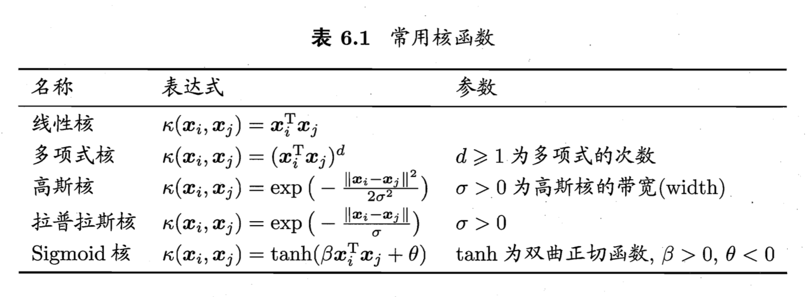

此外，还可以通过函数组合得到

- 若$\kappa_{1}$和$\kappa_{2}$为核函数，则对于任意整数$\gamma_{1},\gamma_{2}$，线性组合：
$$
\gamma_{1}\kappa_{1}+\gamma_{2}\kappa_{2}
$$
为核函数
- 若$\kappa_{1}$和$\kappa_{2}$为核函数，则核函数直积：、
$$
\kappa_{1}\otimes \kappa_{2}(x,z) = \kappa_{1}(x,z)\kappa_{2}(x,z)
$$
也为核函数
- 若$kappa_{1}$为核函数，则对于任意函数$g(x)$，
$$
\kappa(x,z) = g(x)\kappa_{1}(x,z) g(z)
$$
为核函数

### 软间隔与正则化

硬间隔：前面要求的支持向量机形式中所有样本满足约束，划分正确
软间隔：允许某些样本不满足约束：
$$
y_{i}(\omega^{T}x_{i}+b)\geqslant 1
$$
不满足约束的样本应尽可能少，同时最大化间隔，因此优化目标：
$$
\min\limits_{\omega,b} \frac{1}{2}||\omega||^{2}+C\sum\limits_{i=1}^{m}l_{0/1}(y_{i}(\omega^{T}x_{i}+b)-1)
$$
其中$C>0$为常数，$C$为无穷大时所有样本满足约束，$l_{0/1}$为0/1损失函数：
$$
l_{0/1}(z) = \begin{cases} & 1,\, z<0 \\ & 0,\, otherwise \end{cases}
$$
$l_{0/1}$非凸、非连续，使用替代损失函数，通常是凸的连续函数且为$l_{0/1}$的上界
- hinge损失：$l_{hinge}(z) = \max{(0,1-z)}$
- 指数损失：$l_{exp}(z) = e^{-z}$
- 对数损失：$l_{log}(z) = \log{(1+e^{-z})}$

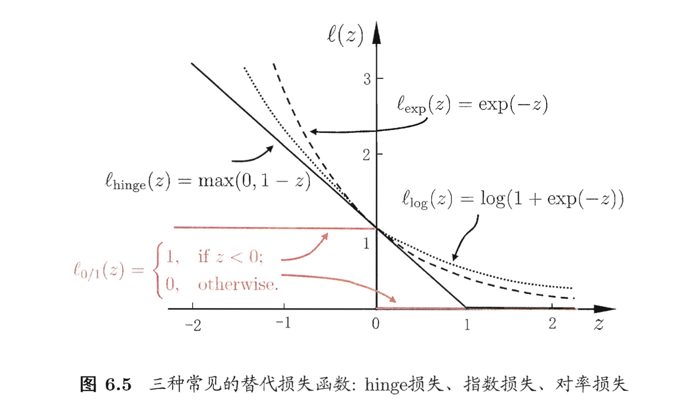

松弛变量$\xi_{i}\geqslant 0$，可重写优化目标：
$$
\min\limits_{\omega,b,\xi_{i}} \frac{1}{2}||\omega||^{2}+C\sum\limits_{i=1}^{m}\xi_{i}$$$$s.t.\, y_{i}(\omega^{T}x_{i}+b)\geqslant 1-\xi_{i},\xi_{i}\geqslant 0,i=1,\cdots,m
$$
软间隔支持向量机

利用拉格朗日乘子法得到软间隔对偶问题：
$$
\max\limits_{\alpha} \sum\limits_{i=1}^{m} \alpha_{i}-\frac{1}{2} \sum\limits_{i=1}^{m}\sum\limits_{j=1}^{m}\alpha_{i}\alpha_{j}y_{i}y_{j}x_{i}^{T}x_{j},(**)
$$

$$
s.t. \, \sum\limits_{i=1}^{m} \alpha_{i}y_{i} = 0, 0 \geqslant \alpha_{i}\geqslant C, i = 1,2,\cdots,m
$$
区别仅有对偶变量的约束

KKT条件：
$$
\begin{align*} & \alpha_{i}\geqslant 0,\mu_{i}\geqslant 0; \\ & y_{i}f(x_{i})-1+\xi_{i}\geqslant 0; \\ & \alpha_{i}(y_{i}f(x_{i})-1+\xi_{i})=0 \\ & \xi_{i}\geqslant 0,\mu_{i}\xi_{i} = 0 \end{align*}
$$
由此，对训练样本$(x_{i},y_{i})$，
- 若$\alpha_{i}=0$，则样本不会出现在求和式；
- 若$\alpha_{i}>0$，则必有$y_{i}f(x_{i}) = 1 - \xi_{i}$，该样本为支持向量；
- 若$\alpha_{i}<C$，则$\mu_{i}>0$，进而有$\xi_{i}=0$，样本恰在最大间隔边界上；
- 若$\alpha_{i}=C$，则$\mu_{i}=0$
    - 若$\xi_{i}\leqslant 1$，则该样本落在最大间隔内部
    - 若$\xi_{i}>1$，则样本被错误分类

由此可见，软间隔支持向量机最终模型仅与支持向量有关，通过替代损失函数仍保持了稀疏性

使用对率损失函数$l_{\log}$即可得对率回归模型，支持向量机与对率回归优化目标相近，性能相当

模型性质与替代损失函数直接相关，但有共性：优化目标第一项描述划分超平面间隔大小，第二项表述训练集上的误差，一般形式：
$$
\min\limits_{f}\Omega(f) + C\sum\limits_{i=1}^{m}l(f(x_{i},y_{i}))(*)
$$
其中$\Omega(f)$称为结构风险，描述模型$f$某些性质，$\sum\limits_{i=1}^{m} l(f(x_{i}),y_{i})$称为经济风险，描述模型与训练数据契合程度，$C$用于二者折中

(*)式称为正则化问题，$\Omega(f)$正则化项，$C$正则化常数
$L_{p}$范数为常用的正则化项

### 支持向量回归(SVR)

回归问题，给定训练样本$D=\{(x_{1},y_{1}),\cdots,(x_{m},y_{m})\},y_{i}\in \mathbb{R}$，希望学得回归模型$f(x) = \omega^{T}x + b$，使$f(x)\rightarrow y$，$\omega,b$为参数

支持向量回归假设能容忍$f(x)$与$y$最多有$\epsilon$的偏差，即仅当$f(x)$与$y$差别绝对值大于$\epsilon$才计算损失

SVR问题形式化：
$$
\min\limits_{\omega,b,\xi_{i}} \frac{1}{2}||\omega||^{2}+C\sum\limits_{i=1}^{m}l_{\epsilon}(f(x_{i})-y_{i})
$$
$C$为正则化常数，$l_{\epsilon}$为$\epsilon$-不敏感损失函数
$$
l_{\epsilon}(z) = \begin{cases} & 0,|z|\leqslant \epsilon \\ & |z|-\epsilon,otherwise \end{cases}
$$
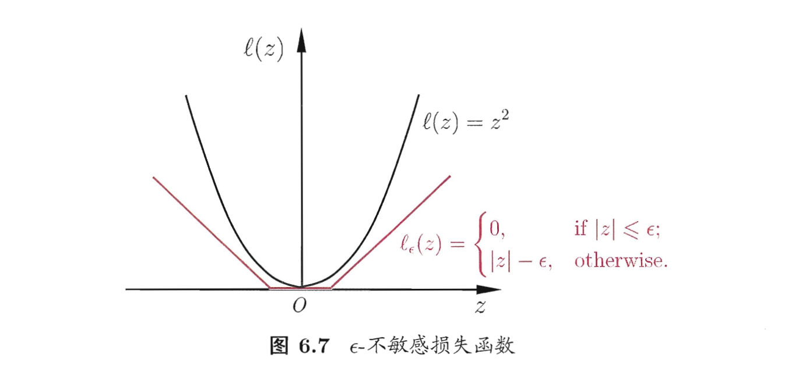

引入松弛变量$\xi_{i},\hat{\xi_{i}}$，可重写问题为：
$$
\min\limits_{\omega,b,\xi_{i}} \frac{1}{2}||\omega||^{2}+C\sum\limits_{i=1}^{m}(\xi_{i}+\hat{\xi_{i}})
$$

$$
s.t. \, f(x_{i})-y_{i}\leqslant \epsilon+\xi_{i}, y_{i}-f(x_{i})\leqslant \epsilon+\xi_{i},\xi_{i}\geqslant 0,\hat{\xi_{i}}\geqslant 0, i = 1,2,\cdots,m
$$
拉格朗日乘子法，得SVR对偶问题：
$$
\max\limits_{\alpha,\hat{\alpha}}\sum\limits_{i=1}^{m}y_{i}(\hat{\alpha_{i}}-\alpha_{i})-\epsilon (\hat{\alpha_{i}}+\alpha_{i})-\frac{1}{2} \sum\limits_{i=1}^{m} \sum\limits_{j=1}^{m} (\hat{\alpha_{i}}-\alpha_{i})(\hat{\alpha_{j}}-\alpha_{j})x_{i}^{T}x_{j}
$$

$$
s.t. \, \sum\limits_{i=1}^{m}(\hat{\alpha_{i}}-\alpha_{i})=0,0\leqslant \alpha_{i},\hat{\alpha_{i}}\leqslant C
$$
KKT条件：
$$
\begin{align*} & \alpha_{i}(f(x_{i})-y_{i}-\epsilon - \xi_{i})=0 \\ & \hat{\alpha_{i}}(y_{i}-f(x_{i})-\epsilon - \hat{\xi_{i})}=0 \\ & \alpha_{i}\hat{\alpha_{i}} = 0, \xi_{i}\hat{\xi_{i}} = 0, \\ & (C-\alpha_{i})\xi_{i} = 0, (C-\hat{\alpha_{i}})\hat{\xi_{i}} = 0 \end{align*}
$$
当且仅当$(x_{i},y_{i})$不落入$\epsilon$-间隔带时$\alpha_{i},\hat{\alpha_{i}}$才可非零，但其中至少有一个为零

SVR解形如：
$$
f(x)=\sum\limits_{i=1}^{m}(\hat{\alpha_{i}}-\alpha_{i})x_{i}^{T}x+b
$$
使$\hat{\alpha_{i}}-\alpha_{i}\neq 0$的样本为SVR支持向量，落在$\epsilon$-间隔带之外，SVR支持向量仅为训练样本的一部分，解仍有稀疏性

于是利用对偶问题求得$\alpha_{i}$后，任意选取满足$0<\alpha_{i}<C$的样本通过下式求解b：
$$
 b = y_{i} + \epsilon - \sum\limits_{i=1}^{m} (\hat{\alpha_{i}}-\alpha_{i})x_{i}^{T}x
$$

$$
 \omega = \sum\limits_{i=1}^{m} (\hat{\alpha_{i}}-\alpha_{i}) \phi(x_{i})
$$
SVR可表示为：
$$
f(x) = \sum\limits_{i=1}^{m} (\hat{\alpha_{i}}-\alpha_{i}) \kappa(x,x_{i})+b
$$
$\kappa(x_{i},x_{j}) = \phi_{x_{i}}^{T}\phi_{x_{j}}$为核函数

### 核方法

给定训练样本，若不考虑偏移量$b$，无论SVM还是SVR，模型总能表示称核函数$\kappa(x,x_{i})$的线性组合

**定理6.2（表示定理）**
令$\mathbb{H}$为核函数$\kappa$对应的再生核希尔伯特空间，$||h||_{\mathbb{H}}$表示$\mathbb{H}$空间中关于$h$的范数，对任意单增函数$\Omega:[0,\infty]\mapsto [0,\infty]$，优化问题
$$
\min\limits_{h\in \mathbb{H}} F(h) = \Omega(||h||_{\mathbb{H}}) + l(h(x_{1}),\cdots,h(x_{m}))
$$
的解总可写成
$$
h*(x) = \sum\limits_{i=1}^{m} \alpha_{i}\kappa(x,x_{i})
$$
核方法：基于核函数的学习方法

通过核化（引入核函数）将现形学习器拓展为非线性学习器
核线性判别分析(KLDA)

假设可通过某种映射$\phi:\chi \mapsto \mathbb{F}$，样本映射到特征空间$\mathbb{F}$，在特征空间执行线性判别分析：
$$
h(x) = \omega^{T}\phi(x)
$$
KLDA学习目标为
$$
\max\limits_{\omega} J(\omega) = \frac{\omega^{T}S_{b}^{\phi}\omega}{\omega^{T}S_{\omega}^{\phi}\omega}
$$
$S_{b}^{\phi},S_{\omega}^{\phi}$分别为训练样本在特征空间$\mathbb{F}$中的类间三度矩阵和类内散度矩阵
$X_{0},X_{1}$第0,1类样本的集合，样本数$m_{i}$，总样本数$m = m_{0}+m_{1}$，第$i$类样本在特征空间$\mathbb{F}$中的均值为
$$
\mu_{i}^{\phi} = \frac{1}{m_{1}}\sum\limits_{x\in X_{1}}\phi(x)
$$
两个散度矩阵分别为：
$$
S_{b}^{\phi} = (\mu_{1}^{\phi}-\mu_{0}^{\phi})(\mu_{1}^{\phi}-\mu_{0}^{\phi})^{T}$$$$S_{\omega}^{\phi} = \sum\limits_{i=0}^{1}\sum\limits_{x\in X_{i}}(\phi(x)-\mu_{i}^{\phi})(\phi(x)-\mu_{i}^{\phi})^{T}
$$
通常难以知道映射$\phi$具体形式，因此使用核函数$\kappa(x,x_{i}) = \phi(x_{i})^{T}\phi(x)$隐式表达映射与特征空间$\mathbb{F}$，把$J(\omega)$作为损失函数$l$，再令$\omega \equiv 0$，由表示定理：
$$
h(x)=\sum\limits_{i=1}^{m} \alpha_{i}\kappa(x,x_{i})
$$
于是
$$
\omega = \sum\limits_{i=1}^{m}\alpha_{i}\phi(x_{i})
$$
令$K\in \mathbb{R}^{m\times m}$为核函数$\kappa$所对应的核矩阵，$(K)_{ij} = \kappa(x_{i},x_{j})$
令$l_{i}\in\{1,0\}^{m\times 1}$为第$i$类样本的指示向量，即$l_{i}$的第$j$个分量为1当且仅当$x_{j}\in X_{i}$，否则$l_{i}$的第$j$个分量为0
令：
$$
\hat{\mu_{0}}=\frac{1}{m_{0}}Kl_{0},\hat{\mu_{1}}=\frac{1}{m_{1}}Kl_{1}$$$$ M = (\hat{\mu_{0}}-\hat{\mu_{1}})(\hat{\mu_{0}}-\hat{\mu_{1}})^{T}$$$$ N = KK^{T}-\sum\limits_{i=0}^{l}m_{i}\hat{\mu_{i}}\hat{\mu_{i}}^{T}
$$
于是，原目标等价为：
$$
\max\limits_{\alpha} J(\alpha) = \frac{\alpha^{T} M \alpha}{\alpha^{T} N \alpha}
$$
使用线性判别分析求解$\alpha$，进而得到$h(x)$

## 贝叶斯分类器

### 贝叶斯决策论

满足两个先决条件：
1. 要决策分类的类别数一定
2. 类先验概率和类条件概率已知

- 样本：$x\in R^{d}$
- 状态：第一类$\omega=\omega_{1},\omega = \omega_{2}$
- 先验概率：$P(\omega_{1}).P(\omega_{2})$
- 样本分布密度：$P(x)$
- **类条件概率密度：$p(x|\omega_{1}),p(x|\omega_{2})$**
- **后验概率：$p(\omega_{1}|x),p(\omega_{2}|x)$**
- 平均错误率：$P(e)=\prod P(e|x)p(x)dx$

基于最小错误率的贝叶斯判别法

Law:
1. 若$P(\omega_{i}|x)=\max\limits_{j=1,2}P(\omega_{j}|x)$，则$x\in \omega_{i}$
2. 若$p(x|\omega_{i})P(\omega_{i})=\max\limits_{j=1,2}p(x|\omega_{j})P(\omega_{j})$，则$x\in \omega_{i}$，因为贝叶斯公式分母为定植
3. 由$\frac{P(x|\omega_{1})}{P(x|\omega_{2})}$和$\frac{P(\omega_{2})}{P(\omega_{2})}$大小关系判断
4. 由3式两边取对数进行大小判断

贝叶斯决策论考虑如何基于相关概率和误判损失选择最优的类别标记

假设有$N$种可能的类别标记，即$Y=\{c_{1},\cdots,c_{N}\}$，$\lambda_{ij}$为将真实标记为$c_{j}$样本误分类为$c_{i}$所产生的损失
基于后验概率$P(c_{i}|x)$可获得将样本$x$分类为$c_{i}$所产生的期望损失，即样本$x$的条件风险：
$$
R(c_{i}|x)=\sum\limits_{j=1}^{N}\lambda_{ij}P(c_{j}|x)
$$
任务是寻找一个判定准则$h:X\mapsto Y$以最小化总体风险
$$
R(h)=E_{x}[R(h(x)|x)]
$$
贝叶斯判定准则：为最小化总体风险，只需在每个样本上选择能使条件风险$R(c|x)$最小的类别标记
$$
h^{*}(x)=\arg\min\limits_{c\in Y} R(c|x)
$$
$h^{*}$称为贝叶斯最优分类器，总体风险$R(h^{*})$被称为贝叶斯风险，$1-R(h^{*})$反映分类器能达到的最好性能，模型精度的理论上限

最小化分类错误率，误判损失：
$$
\lambda_{ij}=\begin{cases} & 0,if i=j \\ & 1,otherwise \end{cases}
$$
条件风险$R(c|x)=1-P(c|x)$
于是最小化分类错误率的贝叶斯分类器
$$
h^{*}(x)=\arg\max\limits_{c\in Y} P(c|x)
$$
后验概率最大的类别标记

首先要活得后验概率，ML要基于有限的训练样本集准确估计后验概率
- 判别式模型，给定$x$，直接建模$P(c|x)$预测$c$
    - 决策树、BP神经网络、支持向量机
- 生成式模型，对联合分布$P(x,c)$建模，由此获得$P(c|x)$

生成式模型考虑：
$$
P(c|x)=\frac{P(x,c)}{P(x)}
$$
基于贝叶斯定理，
$$
P(c|x)=\frac{P(c)P(x|c)}{P(x)}
$$
贝叶斯公式
$P(c)$类先验概率，$P(x|c)$为类条件概率、似然，$P(x)$为归一化的证据因子
给定样本，证据因子与类标记无关，因此需估计先验与似然概率

$P(c)$样本空间各类样本所占比，由大数定律，训练集包含充足独立同分布样本，频率估计概率

### 极大似然估计

类别$c$的类条件概率$P(x|c)$，假设$P(x|c)$具有确定形式且被参数向量$\theta_{c}$唯一确定，用训练集估计参数$\theta_{c}$，为明确，将$P(c|x)$记做$P(x|\theta_{c})$

概率模型训练过程为参数估计过程

令$D_{c}$表示训练集$D$中第$c$类样本组成集合，假设这些样本独立同分布，参数$\theta_{c}$对于数据集$D_{c}$的似然：
$$
P(D_{c}|\theta_{c})=\prod\limits_{x\in D_{c}}P(x|\theta_{c})
$$
寻找最大化似然$P(D_{c}|\theta_{c})$的参数值$\hat{\theta_{c}}$

对树似然
$$
LL(\theta_{c})=\log P(D_{c}|\theta_{c})=\sum\limits_{x\in D_{c}}\log P(x|\theta_{c})
$$
极大似然估计值：
$$
\hat{\theta_{c}}=\arg\max\limits_{\theta_{c}} LL(\theta_{c})
$$
### 朴素贝叶斯分类器

朴素贝叶斯分类器采用属性条件独立性假设，对已知类别，假设所有属性相互独立
因此贝叶斯公式写为：
$$
P(c|x)=\frac{P(c)P(x|c)}{P(x)} = \frac{P(c)}{P(x)}\prod\limits_{i=1}^{d}P(x_{i}|c)
$$
朴素贝叶斯分类器：
$$
h_{nb}(x)=\arg\max\limits_{c\in Y} P(c)\prod\limits_{i=1}^{d}P(x_{i}|c)
$$
朴素贝叶斯分类器训练过程基于训练集$D$估计先验概率$P(c)$，并为每个属性估计条件概率$P(x_{i}|c)$
令$D_{c}$表示训练集$D$中第$c$类样本组成的集合，充足独立同分布样本，先验概率估计：
$$
P(c)=\frac{|D_{c}|}{|D|}
$$
避免其他属性携带的信息被未出现的属性值抹去，估计概率值需要进行平滑，常用拉普拉斯修正：
令$N$表示训练集$D$中可能的类别数，$N_{i}$表示第$i$各属性可能的取值数，
$$
\hat{P(c)}=\frac{|D_{c}|+1}{|D|+N}$$$$\hat{P(x_{i}|c)}=\frac{|D_{c,x_{i}}|+1}{|D_{c}|+N_{i}}
$$
避免训练集样本不充分导致概率估值为0

高斯贝叶斯分类器，样本从高斯分布生成，概率密度只取决于类别$C_{k}$

### 半朴素

适当考虑一部分属性之间的相互依赖信息

独依赖估计(ODE)，假设每个属性最多仅依赖其他一个属性
$$
P(c|x)\propto P(c)\prod\limits_{i=1}^{d}P(x_{i}|c,pa_{i})
$$
$pa_{i}$为属性$x_{i}$依赖的父属性

Q:如何确定每个属性的父属性

超父，所有属性依赖于同一属性，SPODE

TAN，在最大带权生成树算法基础上，将属性间依赖关系约化为属性结构
1. 计算任意两属性之间条件互信息
$$
I(x_{i},x_{j}|y)=\sum\limits_{x_{i},x_{j};c\in Y}P(x_{i},x_{j}|c)\log \frac{P(x_{i},x_{j}|c)}{P(x_{i}|c)P(x_{j}|c)}
$$
2. 以属性为结点构建完全图，任意两个结点之间的边权重设为$I(x_{i},x_{j}|y)$
3. 构建此完全图的最大带权生成树，挑选根变量，将边置为有向
4. 加入类别结点$y$，增加从$y$到每个属性的有向边

AODE，将每个属性作为超父构建SPODE

## 集成学习

组合起来的学习器方法相同：同质，个体学习器：基学习器，基学习算法

方法不同：异质，个体学习器：组件学习器
集成中个体分类器数目$T$增大，集成的错误率指数级下降，最终趋向于0

两类：
- 个体学习器强依赖关系、必须串行生成的序列化方法: Boosting
- 不存在强依赖关系、可同时生成的并行化方法: Bagging/Random Forest

### Boosting

AdaBoost:

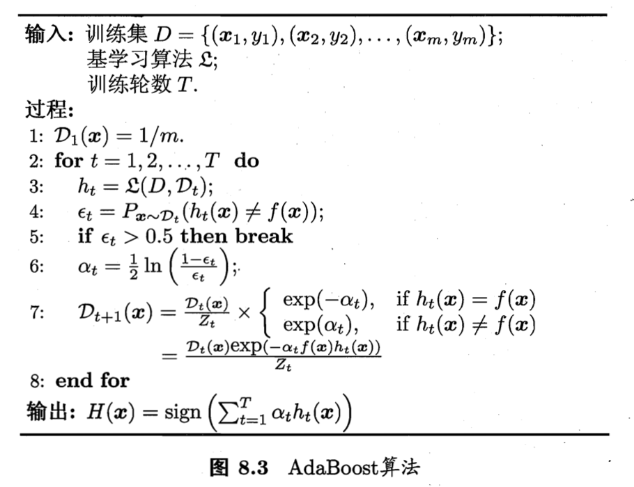

降低偏差

### Bagging & RF

Bagging:有重复采样，每个采样集训练基学习器，基学习器结合，分类任务简单投票，回归任务简单平均

关注降低方差

RF中对基决策树莓哥结点属性集合中随机选择子集，再从子集中随机选择一个最优属性用于划分

### 结合策略

假定集成包含$T$个基学习器$\{h_{1},\cdots,h_{T}\}$，其中$h_{i}$在示例$x$上的输出为$h_{i}(x)$

#### 平均法

数值型输出$h_{i}(x)\in \mathbb{R}$，简单平均/加权平均

#### 投票法

- 绝对多数投票法：若某标记得票超过半数，则预测为该标记，否则拒绝
- 相对多数投票法：预测为得票最多的标记
- 加权投票法

个体学习器输出值的类型：

- 类标记：硬投票
- 类概率：软投票

学习法：Stacking，次级学习器的输入是初级学习器的输出


## 聚类

无监督学习：未知训练样本标记信息

聚类将数据集中样本划分为通常不相交的子集，每个子集为簇，每个簇对应一些潜在类别，类别最初是未知的

样本集$D=\{x_{1},\cdots,x_{m}\}$，每个样本为$n$维特征向量，聚类算法将样本集划分为$k$个不相交的簇$\{C_{l}|l=1,2,\cdots,k\}$，互不相交，用$\lambda_{j}\in\{1,2,\cdots,k\}$表示簇标记
聚类结果：包含$m$个元素的簇标记向量$\lambda = (\lambda_{1};\cdots;\lambda_{m})$表示

### 性能度量

有效性指标
希望簇内相似度高，簇间相似度低
外部指标：与某个参考模型比较
内部指标：直接考察结果

若参考模型给出簇划分$C^{*}=\{C_{1}^{*},\cdots,C_{s}^{*}\}$，簇标记向量$\lambda^{*}$
定义：
$$
a=|SS|,SS=\{(x_{i},x_{j})|\lambda_{i}=\lambda_{j},\lambda_{i}^{*}=\lambda_{i}^{*},i<j\}
$$

$$
b=|SD|,SD=\{(x_{i},x_{j})|\lambda_{i}=\lambda_{j},\lambda_{i}^{*}\neq\lambda_{i}^{*},i<j\}
$$

$$
c=|DS|,SS=\{(x_{i},x_{j})|\lambda_{i}\neq\lambda_{j},\lambda_{i}^{*}=\lambda_{i}^{*},i<j\}
$$

$$
d=|DD|,SS=\{(x_{i},x_{j})|\lambda_{i}\neq\lambda_{j},\lambda_{i}^{*}\neq\lambda_{i}^{*},i<j\}
$$
$a+b+c+d=\frac{m(m-1)}{2}$

外部指标：
- Jacard系数：$JC=\frac{a}{a+b+c}$
- FM指数：$FMI=\sqrt{\frac{a}{a+b}\cdot \frac{a}{a+c}}$
- Rand指数：$RI=\frac{2(a+d])}{m(m-1)}$

结果在$[0,1]$之间，越大越好

对簇划分，定义：
$$
avg(C)=\frac{2}{|C|(|C|-1)}\sum\limits_{1\leqslant i<j \leqslant |C|}dist(x_{i},x_{j})
$$

$$
diam(C)=\max\limits_{1\leqslant i<j \leqslant |C|}dist(x_{i},x_{j})
$$

$$
d_{min}(C_{i},C_{j})=\min\limits_{x_{i}\in C_{i},x_{j}\in C_{j}}dist(x_{i},x_{j})
$$

$$
d_{cen}(C)=dist(\mu_{i},\mu_{j})
$$
$dist(\cdot,\cdot)$计算两样本之间的距离，$\mu$代表簇C的中心点：$\mu=\frac{1}{|C|}\sum\limits_{1\leqslant i\leqslant |C|}x_{i}$，$avg(C)$意义是簇C内样本间的平均距离，$diam(C)$对应簇$C$内样本间的最远距离，$d_{min}(C_{i},C_{j})$对应簇$C_{i}$和$C_{j}$最近样本间的距离，$d_{cen}(C_{i},C_{j})$对应簇$C_{i}$和$C_{j}$中心点间的距离

内部指标：
- DB指数：
$$
DBI = \frac{1}{k}\sum\limits_{i=1}^{k}\max\limits_{j\neq i}{(\frac{avg(C_{i})+avg(C_{j})}{d_{cen}(\mu_{i},\mu_{j})})}
$$
- Dunn指数：
$$
DI = \min\limits_{1\leqslant i \leqslant k}\{\min\limits_{j\neq i}{(\frac{d_{min}(C_{i},C_{j})}{\max\limits_{1\leqslant l\leqslant k}diam(C_{l})})}\}
$$
前者越小越好，后者越大越好

### 距离计算

$dist(\cdot,\cdot)$，作为距离度量需满足：
- 非负性：$dist(x_{i},x_{j})\geqslant 0$
- 同一性：$dist(x_{i},x_{j})= 0$当且仅当$x_{i}=x_{j}$
- 对称性：$dist(x_{i},x_{j})=dist(x_{j},x_{i})$
- 直递性：$dist(x_{i},x_{j})\leqslant dist(x_{i},x_{k})+dist(x_{k},x_{j})$

给定样本$x_{i}=(x_{i1};\cdots ; x_{in}),x_{j}=(x_{j1};\cdots ; x_{jn})$，最常用闵可夫斯基距离：
$$
dist_{mk}(x_{i},x_{j})=(\sum\limits_{u=1}^{n}|x_{iu}-x_{ju}|^{p})^{\frac{1}{p}}
$$
$p\geqslant 1$，为2时 欧式距离，为1时 曼哈顿距离

可用于有序属性

无序属性：使用VDM，$m_{u,a}$表示在属性$u$上取值为$a$的样本数，$m_{u,a,i}$表示在第$i$个样本簇中，$k$为样本簇输
则属性$u$上两个离散值$a,b$的VDM距离为：
$$
VDM_{p}(a,b)=\sum\limits_{i=1}^{k}|\frac{m_{u,a,i}}{m_{u,a}}-\frac{m_{u,b,i}}{m_{u,b}}|^{p}
$$
不同属性重要性不同时，加权距离
$$
dist_{wmk}(x_{i},x_{j})=(\sum\limits_{u=1}^{n}\omega_{u}\cdot|x_{iu}-x_{ju}|^{p})^{\frac{1}{p}}
$$
### 原型聚类

假设聚类结构能够通过一组原型刻画

#### $k$均值算法

给定样本集$D=\{x_{1},\cdots,x_{m}\}$
$k$均值(means)算法针对聚类得到簇划分$C=\{C_{1},cdots,C_{k}\}$最小化平方误差：
$$
E=\sum\limits_{i=1}^{k}\sum\limits_{x\in C_{i}}||x-\mu_{i}||_{2}^{2}
$$
刻画了簇内样本围绕簇均值的紧密程度，越小则簇内样本相似度越高
$\mu_{i}=\frac{1}{|C_{i}|}\sum\limits_{x\in |C_{i}|}x$为簇$C{i}$的均值向量

最小化NP-hard，采用贪心策略，迭代优化

算法：

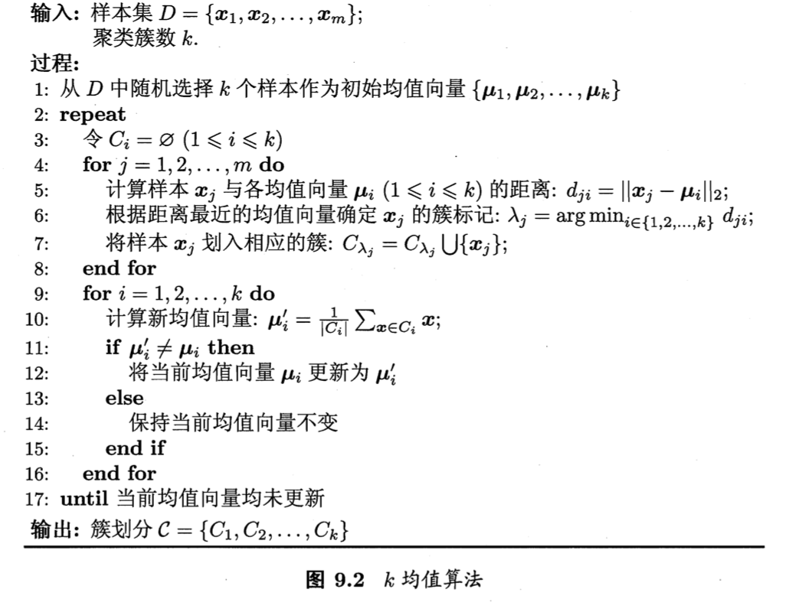

#### 学习向量量化

LVQ，假设数据样本带有类别标记，利用监督信息辅助聚类

样本集$D=\{(x_{1},y_{1}),\cdots,(x_{m},y_{m})\}$，LVQ目标学到一组$n$维原型向量$\{p_{1},\cdots, p_{q}\}$，每个向量代表一个聚类簇，簇标记$t_{i}\in Y$

算法：
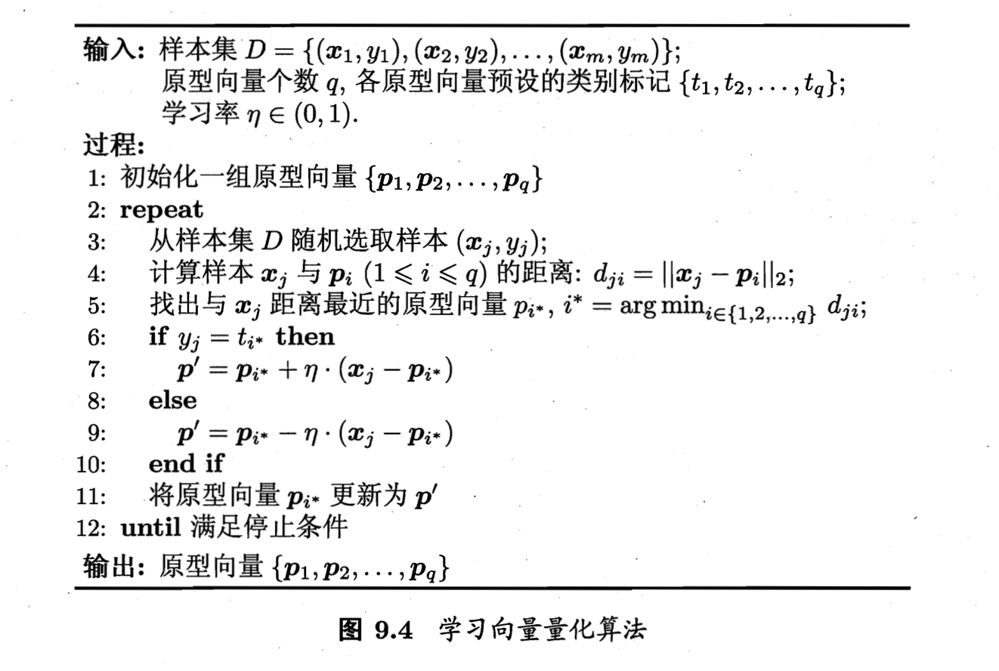

每轮迭代，算法随机选取有标记的训练样本，找到距离最近的原型向量，根据类别标记是否一致来对原型向量进行更新

#### 高斯混合聚类

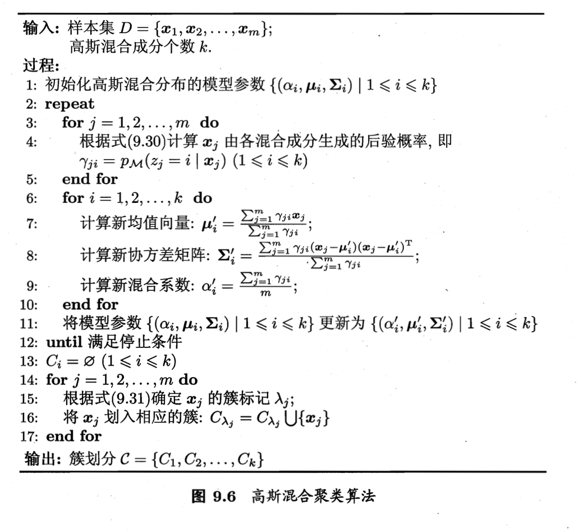

#### 密度聚类

 
