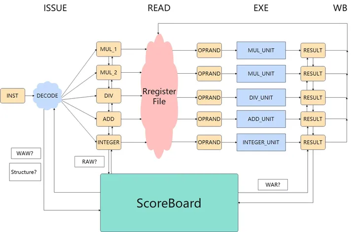
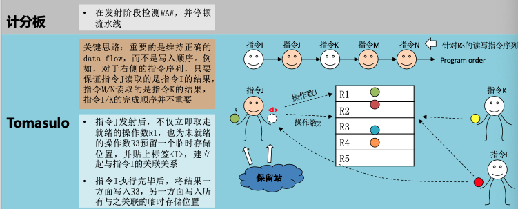
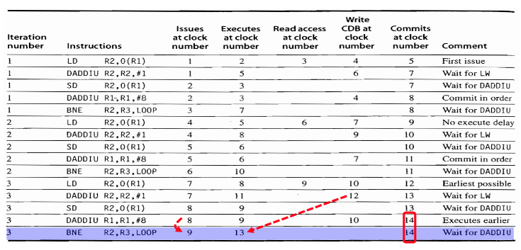
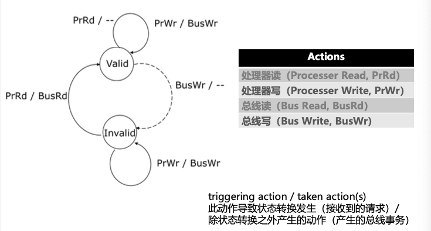
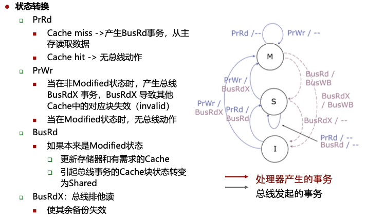
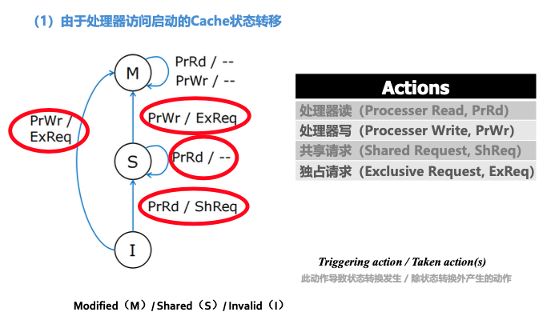
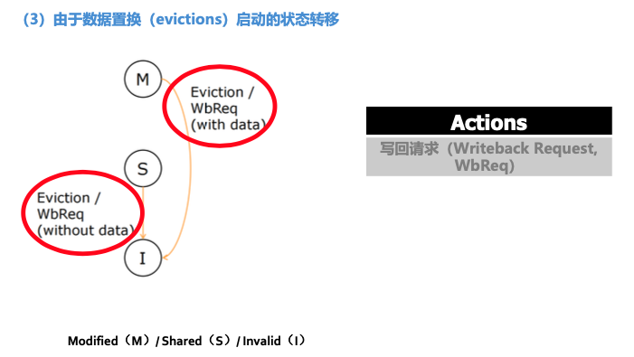
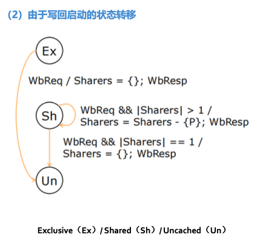
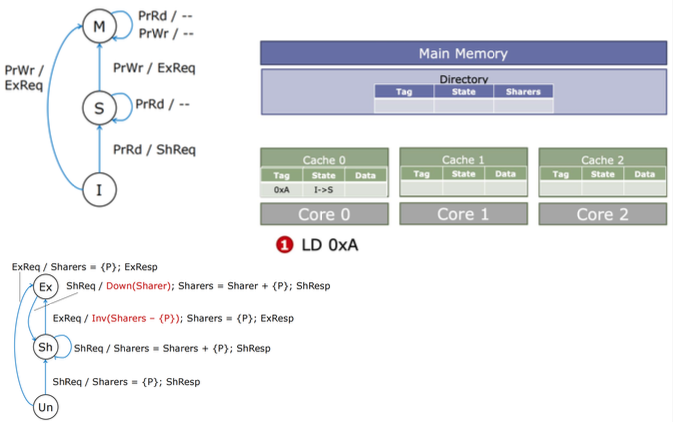
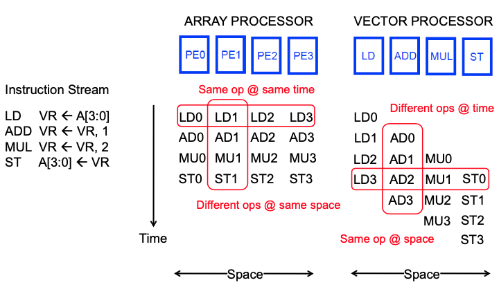

# 计算机体系结构课程笔记

## 复杂流水线和乱序执行

### 静态调度流水线

完全依赖编译器执行指令调度，一旦有指令因为资源冲突或数据依赖而停顿，则后续指令都不允许发射

### 动态调度流水线

允许就绪指令越过前面停顿指令先发射

所有动态调度流水线ID阶段拆分，差别在如何管理已发射、未就绪指令：

- Issue: 对应之前的ID但减少操作，只做：指令译码、资源冲突检测
- Read operands：等待数据冲突结束，读取操作数
    - 非就绪指令停顿在这一阶段，就绪指令由此阶段发射

#### 计分板算法

参考[知乎文章](https://zhuanlan.zhihu.com/p/496078836)

计分板数据结构：

流程：

黄色表示流水段寄存器，指令寄存器(inst)、部件寄存器、操作数寄存器、结果寄存器

执行流程示意图：

相同部件被占用则指令不能Issue，在唯一的INST寄存器中阻塞，后续指令也不能进入INST寄存器

缺点：因为WAR和WAW冒险而产生阻塞

#### Tomasulo算法

核心：寄存器重命名，可彻底消除WAR/WAW冲突

- 需要在值生产者与消费者之间建立通信
- 寄存器重命名：给每个值一个tag
- 给指令提供缓冲区：保留站
- 持续监测值是否可用：准备好则广播tag，消费者匹配tag
- 指令所需全部值准备好则发射

保留站结构：

- busy: 功能部件是否被占用
- op: 具体操作
- vj, vk: 保留源操作数值
- qj, qk: 产生源操作数vj, vk的保留站编号，0表示源操作数已经在vj, vk
- a：为load/store存放address

重命名映射表

| Register | Tag | Value | Valid |
| -------- | --- | ----- | ----- |
| R0       |     |       | 1     | 

WAR消除：

- 计分板：
     - 指令i还有一个操作数(R3)未就绪时不会读取已就绪操作数(R1)
     - 指令j想要写入R1是必须等待i将R1取走
 - Tomasulo：
     - 指令i发射后立即将就绪的操作数R1取走，并保存在一个临时存储位置(S)
     - 指令j可直接写R1
     - 指令i执行时使用S而非R1，重命名

WAW消除：

架构：

调度流程：

- 发射：顺序发射到保留站，判断能否发射的唯一标准是指令对应通路的保留站是否空闲，若指令又可以读取的数据则拷贝到保留站中，后续指令目的寄存器和前序指令重合，则只保留后续指令的写信息。
- 执行：指令通过拷贝数据/监听CDB获得源数据，执行
- 写回：指令在写回阶段通过CDB总线将数据送到寄存器堆和保留站；根据寄存器结果状态表更新寄存器堆

每个执行部件配有一个保留站

ld/sd Issue后计算存储地址占一个周期

例子：

无法实现精确中断，需要加入重排序缓冲，提交阶段应该按照顺序

ROB为循环队列，表项：

### 流水线性能 

$$CPUTime = InstructionCount \times CPI \times Cycle Time$$

### 超标量

双发射、超标量处理器的执行示例：

写CDB下一拍依赖指令可获取值，不需要写寄存器的指令直接commit

## Memory

Memory Array: Address N位，可存储M位Data

- Channel(处理器一侧一个Channel)
    - DIMM(一个卡槽一个DIMM)
        - Rank(一面一个Rank)，64位
            - Chip(一面8个Chip)，8位
                - Bank(一个Chip8个Bank)
                    - Row/Colomn

### Cache

延迟计算：设第$i$层Cache固有访问时间$t_{i}$，感知访问时间$T_{i}$，命中率$h_{i}$，缺失率$m_{i}$

则$T_{i} = t_{i} + m_{i}\times T_{i+1}$

Cache写，写回/写直达/写失效：要写的数据不在cache中，

- 写不分配：将要写的内容直接写回memory
- 写分配：将要写的地址所在的块先从memory调入cache，然后写cache

#### Cache性能

相联度越大，miss rate越小，hit latency和area cost越高

cache miss类型：

- Compulsory miss: 第一次总是miss
- Capacity miss
- Conflict miss

#### 一致性

##### Valid/Invalid协议

总线写将导致Valid$\rightarrow$Invalid，此时读将导致从内存更新，因此Invalid$\rightarrow$Valid

##### 一致性协议

- 写作废策略：一个处理器写之前保证它对该数据项由唯一的访问权，更新之后使得其他备份作废无效
    - 减少数据传输的贷款
- 写更新策略：一个处理器更新时将更新的内容传播给拥有备份的处理器
    - 减少读操作的延迟

***下面两种协议是描述协议底层实现的，根据机器的不同实现不同***

**Snoopy Protocol监听协议**

- 通过广播维护一致性
- 适用于多个处理器通过总线相连的集中式共享存储系统

可扩展性有限

**Directory Protocol目录协议**

- 为每一存储行维持一个目录项，记录所有当前持有此存储行备份的处理器ID以及此行是否已经被改写等信息
- 某处理器改写某行时，根据目录内容只向持有此行备份的处理器发送信号，避免广播
- 适用于分布式共享存储系统

MSI/MESI这种协议只是对于Cache状态的描述，并不涉及底层实现，不能说MSI就是监听/目录协议，而是两者都可，取决于硬件要求

**MSI**

**监听协议**

状态转移图：

和目录协议区别：事务由处理器产生或由总线发起，响应只可能是总线事务，因为M态修改了条目，因此其他处理器的任何读请求都将写回主存（产生BusWB事务）并降级

**目录协议**

Cache状态：

- Modified(M)
- Shared(S)
- Invalid(I)

目录状态：

- Uncached(Un)：所有处理器核心都没有数据副本，I
- Shared(Sh)：一个或多个处理器拥有读权限，对应S
- Exclusive(Ex)：只有一个处理器有读写权限，M

Cache States:

| 条目         | 由于处理器访问                                                          | 由于目录请求                                                  | 由于数据置换                     | 总                             |     |
| ------------ | ----------------------------------------------------------------------- | ------------------------------------------------------------- | -------------------------------- | ------------------------------ | --- |
| 状态机       |                                           |                               |  |  |     |
| 状态转移要点 | 所有写请求都转移至M态，发独占请求，I的读到S，发共享请求，其余读状态不变 | 降级请求M$\rightarrow$S，所有Invalid请求都到I，请求响应相对应 | 写回请求都转到I                  |                                |     |

Directory States:

| 条目         | 由于数据请求                                                     | 由于写回                                        | 总                             |     |
| ------------ | ---------------------------------------------------------------- | ----------------------------------------------- | ------------------------------ | --- |
| 状态机       |                                    |                   |  |     |
| 状态转移要点 | 所有共享请求ShReq都转到Sh，所有独占请求ExReq都转到Ex，无跳转到Un | 写回请求除了当共享者多于1个都转到Un，否则留在Sh |                                |     |

**MESI**

**监听协议**

状态转移图：

**目录协议**

增加E状态：独占，可直接修改缓存，不必同步主存

状态机：

#### 杂项

Cache假共享：不同处理器需要同一Cache line的不同数据，会导致频繁的独占请求和写回（乒乓效应），Cache line实际上没有共享

### 虚存

#### 替换算法

##### Clock

利用R(Reference)/A(Accessed)位判断是否已经使用了页面，需要替换时，顺时针方向遍历环形链表，替换为设置R/A位的第一个frame

#### 虚存与缓存

Translation Look-aside Buffer (TLB)

在L1缓存前进行地址翻译还是之后，即缓存使用虚址还是物理地址

同一个虚址可能对应不同的物理地址，不同的虚址可能映射到同一个物理地址

必须让缓存使用TLB翻译后的物理页框作为index索引set，使用一部分page offset作为tag（虚实一致）

Virtually-indexed Physically-tagged缓存大小限制为$页面大小\times 关联度$

## 指令级并行和多线程

并行种类：

- 指令级并行
    - 定义：单处理器拥有同时执行多条指令的能力
    - 实现方式：一个时钟周期执行多个指令的部分
- 数据级并行
    - 定义：同时处理多个数据元素的能力
    - 实现方式：Vector, SIMD
- 线程级并行
    - 定义：任务被组织成多个线程
    - 实现方式：多核处理器、多处理器、超线程技术

### 指令级并行

前递是前递到对应级别输送到下一级的通路上，实现时前递使用组合逻辑，需要前递时自动将数据填充到流向下一级的data bus中

$CPI<1$，多发射处理器

- SuperScalar超标量
    - 特点：具有多个执行单元，能够在同一时钟周期内发射和执行多条指令
    - 通用计算最成功的方法
- VLIW超长指令字
    - 特点：每个周期流出指令数是固定的

### 线程级并行

保证一条流水线上的指令之间不存在数据依赖关系：在相同流水线中交叉执行来自不同线程的指令，需要传递线程选择信号

多线程开销：

- 每个线程有自己的用户态
    - PC
    - GPRs
- 每个线程需要有自己的系统态信息
    - 虚存页表基址寄存器
    - 异常处理寄存器，其他系统态
- 其他开销
    - 线程冲突导致Cache/TLB冲突
    - OS调度开销

线程调度策略

- 固定交叉模式
    - N个线程，每个线程隔N个周期执行一条指令，若未就绪则插入bubble
    - 消除旁路和互锁
- 软件控制
    - OS为N个线程分配流水线S个时隙（根据Priority差异）
    - 硬件针对S个时隙采用固定交叉模式
- 硬件控制
    - 硬件跟踪可调度线程，根据优先级自动选择线程执行

- 细粒度多线程(FGMT)：每个周期在线程之间进行上下文切换，线程能够连续执行 
- 粗粒度多线程：相隔周期数多

同步多线程(Simultaneous Multithreading)：相同时钟周期内运行多个线程指令，Intel超线程是SMT-2，一个物理核虚拟出两个逻辑核

乱序超标量，增加多上下文切换及取指引擎可以从多个线程取指令，可同时发射

- 私有/共享：指令Cache，分支预测器
- 私有：重命名保留站，ROB
- 共享：执行引擎，寄存器，数据Cache等

## SIMD & GPU

### SIMD

- Array Processor
- Vector Processor

区别：前者每个处理部件都需要有完整的功能、所有功能并行，而后者每个处理部件对应特定功能、不同功能之间并行，Array能够完全并行，Vector仅能够流水处理相同指令

lane：包含向量寄存器堆的一部分和来自每个向量功能单元的一个执行流水线

### GPU

SIMT - single instruction, multiple thread

- large data-parallel operation
    - thread blocks(1 per SIMT core)
        - warps(1 warp 1 SIMT core)
            - in-order pipelines(SIMD lane)

SIMT是SIMD的一种实现方式，两种编程上有不同：

- SIMD每条指令指明不同的数据输入
- SIMT线程自动在warp中执行

SPMD编程模型：处理器执行同样程序但可以对不同数据进行操作

- Grid：许多线程块组成Grid
    - Block：许多线程组成Block
        - Tread

GPU核数量对程序员透明

传统SIMD与Warp-based SIMD区别：

- 传统SIMD包含单线程，按序锁步执行，以SIMD为编程模型，需要指明向量宽度，指令级中含有向量操作指令
- Warp-based SIMD包含多个标量线程，每个线程以SIMD方式运行，不一定锁步，每个线程在不同warp内独立，编程模型不同，无需传递位宽信息，动态线程组给予多线程灵活性，使用标量ISA

需要让warp做的有用功尽可能多，将正交的warp进行merge

## Interconnect

- Network interface：将终端(处理器)接入网络
- Link：载有信号的连线
- Switch/Router：将一些输入通道与一些输出通道相连
- Channel：在router之间的逻辑连接
- Note: Switch/Router
- Message: 向终端传递的单元
- Packet：网络传输单元
- Flit：控制位信号

考虑网络中不同节点的连通性

需要deadlock free，考虑不同包同时到达同一switch该怎么做

流控(flow control)

- 电路开关
- bufferless (packet/flit)
- store and forward (packet)
- virtual cut through (packet)
- wormhole (flit)

